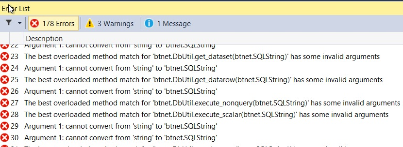

In the previous instalment of this series we took a look at the various security issues present in BugTracker.NET. We identified five vulnerabilities that were worth addressing at once. The most difficult, or at least the most time consuming problem to address is the potential for SQL injection attacks.

BugTracker.NET does not make use of any entity relational mapping tool such as Entity Framework or NHibernate. Instead it uses direct access to the database though ADO.net. To ensure that your ADO.net queries are safe the it is considered best practice to use parameterized queries. Parameterizing queries avoid SQL injection attacks by passing the duty of escaping string onto the database itself.  This ensures that there is no risk of anybody sneaking a value in that will break out of the query and allow an attacker the ability to compromise the data.

Instead of using this approach BugTracker.NET simply escapes strings and replaces them in a query. For instance this is a typical query from the application:

```
sql = @"
/* get notification emails for all subscribers */
select us_email, us_id, us_admin, og.*
from bug_subscriptions
inner join users on bs_user = us_id
inner join orgs og on us_org = og_id
inner join bugs on bg_id = bs_bug
left outer join project_user_xref on pu_user = us_id and pu_project = bg_project
where us_email is not null
and us_enable_notifications = 1
-- $status_change
and us_active = 1
and us_email <> ''
and (   ($cl <= us_reported_notifications and bg_reported_user = bs_user)
or ($cl <= us_assigned_notifications and bg_assigned_to_user = bs_user)
or ($cl <= us_assigned_notifications and $pau = bs_user)
or ($cl <= us_subscribed_notifications))
and
case
when
us_org <> bg_org
and og_other_orgs_permission_level < 2
and og_other_orgs_permission_level < isnull(pu_permission_level,$dpl)
	then og_other_orgs_permission_level
else
isnull(pu_permission_level,$dpl)
end <> 0
and bs_bug = $id
and (us_id <> $us or isnull(us_send_notifications_to_self,0) = 1)";
			}

			sql = sql.Replace("$cl", changeLevel.ToString());
			sql = sql.Replace("$pau", prev_assigned_to_user.ToString());
			sql = sql.Replace("$id", Convert.ToString(bugid));
			sql = sql.Replace("$dpl", btnet.Util.get_setting("DefaultPermissionLevel", "2"));
			sql = sql.Replace("$us", Convert.ToString(security.user.usid));

      DataSet ds_subscribers = btnet.DbUtil.get_dataset(sql);
```
The construction of this query relies on the various parameters having been escaped prior to being inserted into the string. The final few lines of the above code do the replacement of tokens in the query and then pass the query onto a utility function that fetches a dataset.

Now looking through the application I can't actually find any parameters that aren't properly escaped. I think it is likely that they exist, somewhere, and that the large amount of code is obscuring them. However it does require that every parameter be manually escaped. It is very easy to forget such things andy it only takes one mistake to allow an attacker to delete the entire database. The [general advice](https://www.owasp.org/images/d/d4/OWASP_IL_2007_SQL_Smuggling.pdf) is to avoid blacklisting characters.

We want to make sure that not only is the application itself secure but that future developers are prevented, as best as possible, from shooting themselves in the foot. If every query is parameterized then it should act as something of a hint to future developers that they too should parameterize queries.

The funny part about this query is that the syntax for string replacement is not that different from the syntax for parameterizing the query. Unfortunately the replacement syntax is used for code other than replacing parameters in SQL. For instance it is used in replacing tokens in an e-mail subject line

```
// Format the subject line
				string subject = btnet.Util.get_setting("NotificationSubjectFormat", "$THING$:$BUGID$ was $ACTION$ - $SHORTDESC$ $TRACKINGID$");

				subject = subject.Replace("$THING$", btnet.Util.capitalize_first_letter(btnet.Util.get_setting("SingularBugLabel", "bug")));
```
This means that it is going to be difficult to do a full find and replace. My best count for the number of parameters in the project is round about 650.

David and I tossed around a number of ideas about how we could fix this without going through each and every query. We thought about using [PostSharp](http://www.postsharp.net/), an Aspect Oriented Programming framework. It didn't seem like quite the right fit. David suggested [txl](https://en.wikipedia.org/wiki/TXL_(programming_language) a language for manipulating other languages. It looked like a lot more work to learn than to simply work through every change manually. We also talked about whether Roslyn could help us but again it seemed like it would be more work than just fixing the code.

What we need is to find some edge that allows us to do the minimum amount of work to replace the strings and ensure that we replace just the SQL strings.

As it turns out all the database queries run through a single file called DbUtils. This is a common approach and I've seen it in a number of older applications. The functions in this class typically take a string and return a data reader, data table or their ilk. This is exactly the edge we're looking for to manipulate.

The first thing I did was create a new class called ```SQLString```. This class wraps up string and exposes only a few methods.

```
   public class SQLString
    {
        private string _value;
        private IList<SqlParameter> _parameters;

        public SQLString(string value)
        {
            _value = value;
            _parameters = new List<SqlParameter>();
        }

        public SQLString(string value, IList<SqlParameter> parameters)
        {
            _value = value;
            _parameters = parameters;
        }

        public override string ToString()
        {
            return _value;
        }

        public SQLString Replace(string parameter, string value)
        {
            _parameters.Add(new SqlParameter { ParameterName = parameter, Value = value });
            return this;
        }

        public SQLString Append(string toAppend)
        {
            _value += toAppend;
            return this;
        }

        public SQLString Append(SQLString toAppend)
        {
            _value += toAppend.ToString();
            foreach (var param in toAppend.GetParameters())
                _parameters.Add(param);
            return this;

        }
        public IList<SqlParameter> GetParameters()
        {
            return _parameters;
        }
    }
```

Next I went method by method through DbUtils and replaced the signatures on all the methods that took strings so that they took SQLStrings.

That broke everything.



This is actually exactly what I want. By putting this new class in place we've got the compiler to do the hard work of finding every single SQL query in the project. If you've read Michael Feather's excellent book [Working Effectively with Legacy Code](http://www.informit.com/store/working-effectively-with-legacy-code-9780131177055?aid=15d186bd-1678-45e9-8ad3-fe53713e811b) then you'll know this technique as "leaning on the compiler".

Now comes the long and arduous task of going through and replacing all the SQL strings. At least we have a pretty good list to watch ticking down. The general pattern for fixing up the string is

1. Replace string with SQLString
1. Replace all the parameters listed as $param with @param
1. Remove any quoting of the variables in the string
1. Remove any escaping that has been plugged in to the parameters

An typical example is that we change

```
string sql = @"
declare @user_cnt int
declare @email_cnt int
declare @pending_user_cnt int
declare @pending_email_cnt int
select @user_cnt = count(1) from users where us_username = N'$us'
select @email_cnt = count(1) from users where us_email = N'$em'
select @pending_user_cnt = count(1) from emailed_links where el_username = N'$us'
select @pending_email_cnt = count(1) from emailed_links where el_email = N'$em'
select @user_cnt, @email_cnt, @pending_user_cnt, @pending_email_cnt";
sql = sql.Replace("$us", username.Value.Replace("'", "''"));
sql = sql.Replace("$em", email.Value.Replace("'", "''"));

DataRow dr = btnet.DbUtil.get_datarow(sql);
```

to

```
var sql = new SQLString(@"
declare @user_cnt int
declare @email_cnt int
declare @pending_user_cnt int
declare @pending_email_cnt int
select @user_cnt = count(1) from users where us_username = @us
select @email_cnt = count(1) from users where us_email = @em
select @pending_user_cnt = count(1) from emailed_links where el_username = @us
select @pending_email_cnt = count(1) from emailed_links where el_email = @em
select @user_cnt, @email_cnt, @pending_user_cnt, @pending_email_cnt");
sql = sql.Replace("us", username.Value);
sql = sql.Replace("em", email.Value);

DataRow dr = btnet.DbUtil.get_datarow(sql);
```
Here you can see we've changed a few things. The parameter format has been changed in the SQL proper, the replacement of single quotes has been eliminated in the replacements and the sql variable has been changed from a raw string to a SQLString.  

Of course we wouldn't be having fun if there weren't countless special cases. For instance not every time a value was inserted into SQL was Replace used. An example was

```
sql += " select og_id, og_name from orgs where og_id = " + Convert.ToInt32(security.user.org) + " order by og_name;";
```
In cases like this one we cut out the string concatenation and replaced it with a parameter. There were all sorts of interesting edge cases that required just a bit of thought to correct.

Another big problem was the use of custom columns in the database. See BugTracker.NET allows you to add your own columns to table definitions. So if you want your bug to have a field in it called "Time for Monkeys to Fix This" then you can add it as a custom column definition and it will be appended to the table. This makes the SQL vastly more complicated because you are pretty much forced to concatenate strings: you cannot currently use parameters in the definition of a query.

This poses a difficult problem: I'd like to keep the custom column functionality but I don't want to complicate the SQL and introduce the possibility of more injection attacks. After some discussion we decided to rip out the custom columns for now. Eventually we'll put them back in using a properties table pattern. In effect each custom column would become a row in a key value store style table.


When querying for a bug we can look for all the entires in this table to find the properties. It makes some filtering queries a bit harder but we will have a search engine in place for that.

I chugged along for some time fixing the various queries in the application. I spent a lot of time without a compiling application, which always makes me nervous. Eventually I got to the point where the application would compile. With baited breath I launched the application to see if it would work.

It would have been marvellous to have some automated tests at this juncture to give me satisfaction that I had not completely broken the application. It is tough to know when to introduce these sorts of tests. Introducing them too early gets you a set of tests that you're going to break just through refactoring but add them too late and they lose a lot of their potential.

As it turns out the tests were unnecessary because it was immediately apparent that the application was broken. BugTracker.NET uses a lot of queries on the search page that are stored simply as strings in the database. I hadn't updated these queries to replace the old parameters syntax.

With that fixed I tried out the application again to find it didn't work at all. As it turns out when you compile an ASP.net application in Visual Studio the compiler more or less just assumes that anything in a .aspx file is perfect. This code is compiled at runtime so errors don't show up until you've deployed the application. There were substantial errors in the .aspx files as they contained quite a bit of database code.

The compilation of .aspx files is performed by an application called aspnet_compiler.exe. We can actually hook this compiler into our build process so that we can be warned at build time that there are issues in the .aspx code.

To do this we need to open up the project file in a text editor. First add a parameter called ```MvcBuildViews``` in the debug property group near the top of the file.

```
<MvcBuildViews>true</MvcBuildViews>
```
We use this parameter name as it one that is used by ASP.net MVC projects so it is about as close to a standard as we're going to get. Next we add a new target to invoke the compiler

```
<Target Name="PrecompileWeb" AfterTargets="build" Condition="'$(MvcBuildViews)'=='true'">
  <Message Text="Starting AspNetCompiler for $(ProjectDir)" Importance="high" />
  <AspNetCompiler
    VirtualPath="temp"
    TargetPath="$(ProjectDir)/obj/precompiled"
    Force="true"
    PhysicalPath="$(WebProjectOutputDir)"
      Debug="true"
  />
</Target>
```

[View the Commit](https://github.com/dpaquette/BugTracker.NET/commit/c6201f790a80bcfb678ce2cd54810277e0caaaab)

With this in place I discovered another hundred and fifty places in need of updating. When these were fixed another hundred and fifty errors poped up. It looks like there might be some batching of files sent to the aspx compiler and that if any one batch fails the processing stops before hitting the next batch. In the end there were about 500 places in need of changes. This took, obviously, more than one commit.

[View the Commits](https://github.com/dpaquette/BugTracker.NET/commits/SQL_Parameters)

All in all the replacement effort took probably three full days worth of programming to fix everything (although it took me much longer as I'm not working on this full time - thank goodness). Our return on investment is a system that should no longer be vulnerable to SQL injection attacks. Better, in my mind, is that the code directs future maintainers into the pit of success when it comes to avoiding injection vulnerabilities. Anybody adding a new SQL query would be forced to understand a little bit about SQLString when building the new queries.

Now that we have the SQL string in place we can return our attention slightly to some of the names in it. When we first built the class it was done to make as few a changes as possible to the existing code. That's why we ended up with the function name ```Replace```. I don't like that name as it avoids all mention of parameters: a concept we'd like to surface for future developers. Looking at a new code base I would feel reassured that the previous developers knew what they were doing around SQL injection if they mentioned parameters.

We can use the refactoring tools in SQL server to go through the entire application and fix any mention of "Replace" within the context of SQLString. A better name is ```AddParameterWithValue```

[View the Commit](https://github.com/dpaquette/BugTracker.NET/commit/c5ce43e3f8f4a95e69b6bbd0293c0520a7ad728f)

Going forward maintenance developers will end up using the SQLString class to access the database and, without going out of their way, won't create SQL injection opportunities. I think of this as directing people towards the pit of success - they cannot help but fall into it.

SQL injection is a very common attack and we've mitigated the risk here. In the next post we will look at the password system within BugTracker.NET that has some pretty serious flaws.
