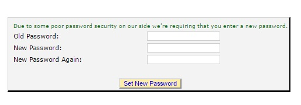
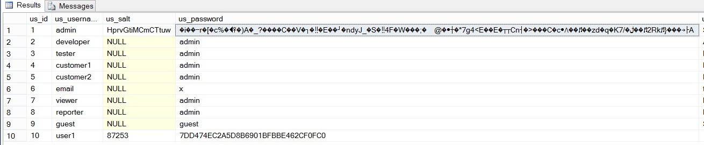

#Password Hashing

Storing passwords is always a tricky proposition. For a great number of sites they have simply washed their hands of the responsibility by outsourcing to a third party such as Twitter, Google or even Facebook. This is usually done through a system known as OpenID. It exploits the difference between authentication and authorization. Authentication is proving that somebody is who they say they are. This can be done with a password or through a multi-factor system that can include text messages or an app on a cell phone.

Authorization is the act of matching a user with a set of permissions. So I could be authenticated as Simon and authorized to edit bugs.

When storing a password there are a couple of ways to do it - most all of them are wrong. Encryping passwords seems like a good idea at first but if the encrypted passwords are leaked, as seems to happen with alarming regularity, then an attacker could decrypt the passwords. This is a bad situation because many people reuse passwords from site to site. Not only do you put your own site at risk but also other sites. With a password and an e-mail address it is possible the attacker could log into a banking website or some other high impact site. This is the reason that it is recommended that people use distinct passwords for each website.

Hashing passwords is a far better idea. A hash is a one-way function that cannot be reversed to reveal the password. When hashing it is important to hash not just the user's password but to combine it with a nonance. A nonance, sometimes erroneously called a salt, is a string of random characters that is appended to the unhashed password before hashing. This random string acts as protection from an attack using rainbow tables. A rainbow table is a large database that maps passwords with the hashes they generate. Many popular hashing algorithms have rainbow tables which permit near instantaneous exploration of a large percentage of the key-space. Nonances invalidate this approach as the key in the rainbow table maps to the password + nonance. Without knowing the nonance an attacker is not able to enter any password that will work. The key in the rainbow table is unlikely to be the actual user password and more likely to be a string that simply hashes to the same value so it will not be obvious what the users's password is.

Even when hashing passwords we need to remain vigilent about the implementation. Many common hashing functions such as MD5 and SHA are designed to be as fast as possible. Their purpose is to give a checksum of a file so you know if the file is correct. For this application we want hashing large quantities of data to be as simple and fast as possible. The opposite is true of password hashing. We would like to take as substantial amount of time to avoid brute force attacks. A possible algorithm is the bcrypt algorithm. It is interesting as it is a tuneable algorithym that can easily be made to take longer as computer resources get cheaper.

How easy is it to break a password hashed with a low grade hashing function? Well famed hacker Kevin Mitnick give a hint:

<blockquote class="twitter-tweet" data-partner="tweetdeck"><p>I love my new 4 GPU password cracker. Over 60 BILLION NTLM hashes a second. :-)&#10;Unfortunately, Md5crypt is much slower. I need to add cards.</p>&mdash; Kevin Mitnick (@kevinmitnick) <a href="https://twitter.com/kevinmitnick/status/519105934246051840">October 6, 2014</a></blockquote>
<script async src="//platform.twitter.com/widgets.js" charset="utf-8"></script>

A 2005 paper, [Attacks on MD5 Hashed Passwords](http://pamsusc.googlecode.com/svn-history/r38/CSCI555/thesis/papers/RAINBOW_report.pdf_), by Robertiello and Bandla suggested they could brute force an MD5 password in 96 hours using a simple CPU based approach. Modern GPU approaches coupled with cheap hardware and even elastic computing makes cracking MD5 not only possible but easy.

This is not to say that a bug database would be a high value target but the amount of effort needed to make encryption difficult to break is pretty small.

There are a couple of options for fixing the password problem in BugTracker.NET. The ideal solution is to rip out all the entire authentication system and replace it with something like [ASP.net Identity](http://www.asp.net/identity). Identity is well designed (at least in this version, don't ask about version 1) and well tested. It also brings in functions to throttle logins, change passwords and all that good stuff. This is, however, a pretty large undertaking.  
We're in the business of getting the best solution for the least amount of work. We can solve most of the issue here simply by replacing the hashing algorithm.

There is no well checked implementation of bcrypt on the .net platform. There is, however, an alterntative in the PKDBF2 algorithm as defined in RFC 2898 in the base class library. This algorithm is similar to bcrypt in that it has an interations setting that permits making the algorithm take longer thus increasing the cost to the attacker.

So now that we know the algorithm we need to decide how we're going to migrate to it. Looking at the source code it seems like, perhaps, this is not the first time that somebody has attempted to improve password security.

A slightly sanitized version of the original code is

````
   public static bool check_password_with_db(string username, string password, DataRow dr)
        {
            int salt = (int)dr["us_salt"];
            string encrypted;
            string databasePassword = (string)dr["us_password"];

            if (databasePassword.Length < 32) // if password in db is unencrypted
            {
                encrypted = password; // in other words, unecrypted
            }
            else if (salt == 0)
            {
                encrypted = Util.HashString(password);
            }
            else
            {
                encrypted = Util.HashString(password + Convert.ToString(salt));
            }

            if (encrypted == databasePassword)
            {
                // Authenticated, but let's do a better job encrypting the password.
                // If it is not encrypted, or, if it is encrypted without salt, then
                // update it so that it is encrypted WITH salt.
                if (salt == 0 || databasePassword.Length < 32)
                {
                    btnet.Util.update_user_password((int)dr["us_id"], password);
                }
                return true;
            }
            else
            {
                Util.write_to_log(String.Format("User {0} entered an incorrect password.", username));
                return false;
            }
        }
````

It appears that BugTracker.NET originally accepted plain text passwords then added hashing using MD5 (note that is is incorrectly called encrypted here) and then added MD5 hashing with a salt (really a nonance). If either of the earlier two approaches is used then the system will upgrade the stored password to the newest version.

At issue here is that if the password database has already been compromised there is no password change required and the user continues to be compromised. Ideally we would do a mass reset of everybody's password. We have the user's e-mail addresses  so we can send them a message but what to send them?

We don't want to send a new password in plain text. If somebody is reading their mail we've just given the evil reader access to the system. The best we can do is send a reset link which, coupled with their old password, will allow setting a new one. It would require an attacker to have access to both cracked versions of the password file and the e-mail account of the user.

#Adding the New Password Check

The very first step is to rip out the existing MD5 based password algorithm and put in place the PKDBF2 algorithm. In the code it is called RFC2898. At the same time we'll simplyfiy the hashing function to be a bit clearer.

The old method looked like
```
public static string encrypt_string_using_MD5(string s)
		{

			byte[] byte_array = System.Text.Encoding.Default.GetBytes(s);

			System.Security.Cryptography.HashAlgorithm alg =
				System.Security.Cryptography.HashAlgorithm.Create("MD5");

			byte[] byte_array2 = alg.ComputeHash(byte_array);

			System.Text.StringBuilder sb
				= new System.Text.StringBuilder(byte_array2.Length);

			foreach(byte b in byte_array2)
			{
				sb.AppendFormat("{0:X2}", b);
			}

			return sb.ToString();
		}
```
The new method looks like

```
public static string HashString(string password, string salt)
		{
            Rfc2898DeriveBytes k2 = new Rfc2898DeriveBytes(password, System.Text.Encoding.UTF8.GetBytes(salt));
            var result = System.Text.Encoding.UTF8.GetString(k2.GetBytes(128));
            return result;
		}
```
[View the Commit](https://github.com/dpaquette/BugTracker.NET/commit/3e42d03a344b62c6973921f77b7a75790d100515)

You may notice that the function has been renamed to be less specific to the technology used and to reference the fact that we're hashing and not encrypting the text. This is a good time to mention that this work is being done in a branch otherwise we're going to break passwords for everybody.

The next step is to simplify the login process. We no longer want to allow plain text passwords, MD5 hashed passwords or even MD5 hashed passwords with a nonance. The only valid password now is one using the new hash.

[View the Commit](https://github.com/dpaquette/BugTracker.NET/commit/3e42d03a344b62c6973921f77b7a75790d100515)

##Database Updates

There will need to be a couple of database changes to support the new password hashes. They will be a lot larger than the previous one and at the same time we upgraded the salt from a simple integer to a full random string. The database in BugTracker.net is defined in a simple SQL script and there is also an upgrade script.

[View the Commit](https://github.com/dpaquette/BugTracker.NET/commit/0c5c80b758bfafebd88d200bb57bdfd0770a2e57)

If you look at the script you may notice that I mentioned in the upgrade script that the new version is 4.0. I'm not sure how the versioning has been done previously with BugTracker.net but we will be supporting [Semantic Versioning](http://semver.org/) going forward. This project will be a major version bump as we're changing a great deal.

##Password Update Screen

Now we need to add a screen that will be used to upgrade people's passwords.

A> This is the first time we've added any real new pages to the site. For the moment we're going to add these pages as webform pages in keeping with the rest of the site. The only reason we're doing so is to avoid having the conversation about WebForms vs. MVC at this point - that's still to come!

We'll start by adding a new page that we'll call UpdatePassword.aspx. On this page we'll add a few simple text boxes for entering a new password.



A>You many notice that in the message on this page we've taken responsibility for the password change. I've found that people are pretty forgiving if you admit fault right away. We all make mistakes.

The page itself is pretty simple. We check the username and password reset key which are passed in from an e-mail sent to the user and the old password entered on the form. If they match then we call out to our updated password change code and enter the new password and a refreshed salt.

[View the Commit](https://github.com/dpaquette/BugTracker.NET/commit/1905d72e77550e8cbc6bca5854d66a0fa66724a1)



##Sending Password Resets

The final step in the process is to build ourselves a tool to send out the e-mails to our users. This tool could be either a web page or a command line tool. BugTracker.net is a web application so let's stick with a web page. The page must be a protected admin page as we don't want regular folks triggering a massive password reset.

The code to perform the updates is simple and looks like

```
 var sql = new SQLString("select us_id, us_email, us_username from users");
 using (var reader = DbUtil.execute_reader(sql, System.Data.CommandBehavior.Default))
            {
                while (reader.Read())
                {
                    var id = reader.GetInt32(0);
                    var updateQuery = new SQLString("update users set password_reset_key=@resetKey where us_id = @id");
                    updateQuery.AddParameterWithValue("@id", id);

                    var resetKey = Util.GenerateRandomString();
                    updateQuery.AddParameterWithValue("@resetKey", resetKey);

                    var emailAddress = reader.GetString(1);
                    var username = reader.GetString(2);
                    DbUtil.execute_nonquery(updateQuery);
                    SendMail(emailAddress, resetKey, username);
                }
            }
```
We don't need to actively invalidate the existing passwords as we've changed the hashing algorithm so no old password hashes will continue to be valid.

A>This code is not the most efficient piece of programming. We hit the database with at least as many queries as we have users. If you had a very large user base this script would take a long time to run during which time users who were not e-mailed would not be able to log in. In this scenario you might shift the e-mail sending to when a user actually tries to log in. The workflow might look like:

A>Attempt login -> Get Email -> Reset Password -> Login

[View the Commit](https://github.com/dpaquette/BugTracker.NET/commit/d321a268c7c5abea4f046d7da8b3a4e3edba9af9)

##Strong New Hash

With a minimum of effort we now have a very strong password hashing algorithm in place. The complexity of the hash should be enough to keep us safe for quite some time. Because the algorithm is tuneable we can increase the number of iterations from the default 1000 as computing power increases.
