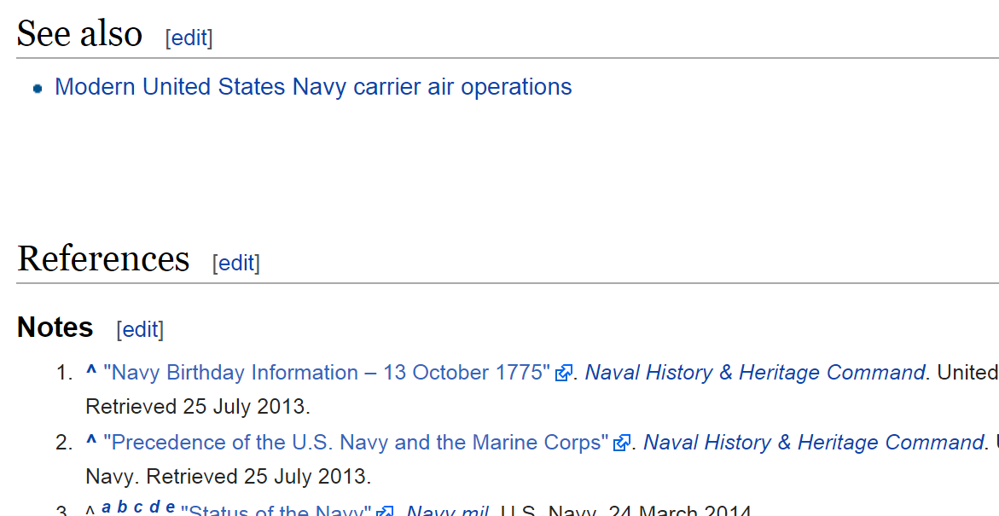

In today's post on improving the security of our ASP.NET applications, we tackle the problem of unvalidated redirects and forwards. Before we get started, here is a recap of the problem we found during our security review.

##Unvalidated Redirects and Forwards
The concern here is that we might have a page that forwards a user to another page as specified by a url in a query parameter. This would allow an attacker to create a link that seemed to go to a BugTracker.NET deployment but didn't actually. For instance one might create a URL like so

    http://legitimate.example.com/refer?url=http://evil.example.com

The page refer would send a user on to another site. This other site could be made to look exactly like an install of BugTracker.NET such that it would trick users into revealing secret data. For instance imagine a fake password change page that required the users to enter their old password. The password would then be captured by the evil site allowing them to exploit the original site. A typical example of a place where this might be used is on a login screen where it refers the user back to the page they tried to visit without being authenticated.

Testing this with exact exploit with BugTracker.net we find that it is indeed vulnerable to such attacks. On my local build of BugTracker.NET I can enter

    http://localhost:33616/default.aspx?url=http://google.com

This takes me to the login page and once I log in I find my browser redirected to the google home page.

##Validating Redirects
Validating the redirect on the server is a fairly straight forward process. All we need to do is check if the url specified in the query parameter represents a legitimate local url to BugTracker.NET. If the url is not local, we can simply redirect the user to a default page.

We could write this logic ourselves, but I would rather use an existing method if possible. As it turns out, the [UrlHelper.IsLocalUrl](http://msdn.microsoft.com/en-us/library/system.web.mvc.urlhelper.islocalurl.aspx) method does exactly what we need. The only problem is that this method is in System.Web.MVC, which we are not referencing yet.

Let's start by installing the MVC NuGet package

    Install-Package Microsoft.AspNet.Mvc

It might seem like overkill to add references to the MVC framework just to use this single method, but I know that we are planning to start using MVC soon so now is as good a time as any to introduce the dependency.

Now we can add the check to validate the url before redirecting the user. In BugTracker, the redirect logic is handled in the Util.redirect method.

      public static void redirect(HttpRequest Request, HttpResponse Response)
      {
          // redirect to the page the user was going to or start off with bugs.aspx
          string url = Request.QueryString["url"];
          string qs = Request.QueryString["qs"];

          UrlHelper urlHelper = new UrlHelper(Request.RequestContext);
          if (String.IsNullOrEmpty(url) || !urlHelper.IsLocalUrl(url))
          {
              string mobile = Request["mobile"];
              if (String.IsNullOrEmpty(mobile))
              {
                  Response.Redirect("bugs.aspx");
              }
              else {
                  Response.Redirect("mbugs.aspx");
              }
          }
          else
          {
              Response.Redirect(remove_line_breaks(url) + "?" + remove_line_breaks(HttpUtility.UrlDecode(qs)));
          }
      }

We first create an instance of the UrlHelper class, then use the UrlHelper to determine whether or not the url is a local url. Overall, this was a very simple change that has a big positive impact on the security of our application.

[View the commit >>](https://github.com/dpaquette/BugTracker.NET/commit/f9e82c62e851282013ae45f5eb80ff06b38616ce)

##Highlighting External Links
Another way to improve security is to warn the user when a link will forward them to another website. This is important because in BugTracker, a user can add a link inside a bug description. Much like the evil redirect, the destination page could be made to look exactly like BugTracker and attempt to trick the user into revealing secret data.

We like the approach that Wikipedia takes here. Any links that will take the user to a site outside of Wikipedia are highlighted with an external link icon.

This is actually relatively easy to accomplish using jQuery and CSS. First, we will add the following line of JavaScript to find all the external links and add the external-link class.

    

Normally, we would add this code to our MasterPage file so it is included in all the pages of the website. BugTracker does not use master pages yet, so we have added it to the section that renders the BugTracker menu instead. We will be looking at adding master pages in a future post.

Next, we will add the following to our main CSS file.

    a.external-link {
        background-image: url('Content/images/ExternalLink.png');
        background-image: url('Content/images/ExternalLink.svg'), none;
        background-repeat: no-repeat;
        background-position: right center;
        padding-right:13px;
        display:inline-block !important;
     }

Note, we are using the [external link icon from Wikimedia Commons](http://commons.wikimedia.org/wiki/File:Icon_External_Link.svg). For browsers that support it, we are using the SVG version of the icon and using a png version for older browsers like IE8.

[View the commit >>](https://github.com/dpaquette/BugTracker.NET/commit/f055a324c19bf4b565d705b9fde3f99ce3ce92f6)

As you can see, external links in BugTracker.NET are now highlighted with the external link icon.

At this point, everything appears to be working as expected but after further testing we noticed that the jQuery code to highlight external links was crashing on a number of pages. As it turns out, jQuery is NOT loaded on all pages. Again, the lack of master pages means we have no centralized place to add a reference to all our pages. We are going to need to bump the 'master pages' feature up in our priority list.

Unfortunately, we can't simply add the jQuery script reference to the write_menu method above. If we do that, we will break some of the pages that already have jQuery and jQuery UI loaded. As a work-around, we decided to introduce RequireJS to dynamically load jQuery if it has not already been loaded. You can read more about this technique in the [RequireJS  docs](http://requirejs.org/docs/jquery.html).

[View the Commit >>](https://github.com/dpaquette/BugTracker.NET/commit/dcba3ce53539e084a691811cdc1c31fc7929833f)

###Optimizing the background images
One final thing before we wrap this up. We can optimize our CSS by taking the external link background images and base64 encoding them directly into the stylesheet. For small images, this is more efficient because it eliminates the need for a separate HTTP request to retrieve the image.

We used a smart tag available via the [Web Essentials plug-in](http://vswebessentials.com/features/stylesheets) to do this for us.

[View the commit >>](https://github.com/dpaquette/BugTracker.NET/commit/e5f7f42d3b528895d8fa0c87e23cb0133e85f798)
