#Application Style and Layout
We have come a long way in our process of updating Bug Tracker.NET. We have made major improvements to the code structure, reducing duplication, improving security, and paving the way for using newer technology. As software developers, it is easy for us to look at the changes and see the value. As a user, these changes have largely been invisible. The application has changed very little from the user's perspective. It is finally time to make some changes to the UI.

Simon and I are both developers, not designers. You might think that we are not necessarily the best suited to tackle a redesign of the UI. Ideally, this work would be completed with an experienced designer on the team. The reality is that we often do not have access to designers, especially when working on internal line of business applications. Despite our lack of formal design training, Simon and I have both had some great success with redesigning  older applications. This is one area where the impact can be much bigger than you might expect.

Here is a little anecdote from Simon:

>I had just started at a company that had some internal and external tools. Over the year before I got there they had focused on the external tools and hadn't done anything with the internal ones. We wanted to start working on it again but nobody could quite remember how to release it. So my first task was to figure out how to build and release it. I made a few style changes to it just so I could see that the site had been deployed correctly and that we weren't using some old version of the site. I replace some ugly greeny-yellow backgrounds with a light blue. The week after we did our first release we started getting feedback from our internal customers that the "new site" was far more performant and had fewer bugs that the old site. I'd changed literally nothing but the colours but people were delighted by it. Style does matter.

Let's see if we can get similar results by improving the styling in BugTracker.NET.

##Choosing a Framework
A good CSS framework can help you provide consistent layout and look and feel throughout your application. There are countless options to choose from but the most popular today seem to be [Foundation](http://foundation.zurb.com/) and [Bootstrap](http://getbootstrap.com/css/). We could also roll our own CSS, but I would recommend against that unless you consider yourself to be a CSS ninja.

We will choose Bootstrap. Since Bootstrap is used in the default ASP.NET application templates, it is likely that any Microsoft web developer joining the team would have some previous experience with it.

To start with, we will add a reference to Bootstrap via Nuget:

`Install-Package Bootstrap`

This installs a set of CSS, JavaScript and font files into the application Content and Scripts folders. Now we need to ensure that each page in BugTracker.NET properly references these files. In previous versions of BugTracker.NET, this would have been a daunting task. Luckily, we recently introduced master pages. Now, we can do easily add these references everywhere by adding the references to the 2 master pages.

In the head tag, we add a reference to the main CSS file:

`<link href="Content/bootstrap.min.css" rel="stylesheet" />`

Also in the head tab, we will add a couple meta tags. The first one is to ensure the latest rendering engine is used in Internet Explorer. The second is to ensure the page width resizes properly on mobile browsers:

````
     <meta http-equiv="X-UA-Compatible" content="IE=edge">
     <meta name="viewport" content="width=device-width, initial-scale=1">
````

At the end of the body, we add a reference to the Bootstrap JS file:

`    <script src="Scripts/bootstrap.min.js"></script>`

[View the commit - Added Bootstrap](https://github.com/dpaquette/BugTracker.NET/commit/9dc3c6f5cb598d40aeea30bd0938b65c7f3180db)

Now that we have Bootstrap available, we need to decide where to start. In a typical production web application, we could easily identify the most visited pages by checking the web server log files. The most visted pages are a good place to start as they would have the highest potential positive impact. In the case of BugTracker, we don't have access to web server logs. Luckily, it is pretty easy to make an educated guess at the which are the most visited pages:
- Login
- Bugs List
- View/Edit Bug
- Add Bug

##Updating the login page
The very first thing a users sees when visiting BugTracker.NET is the login screen. We will start our journey by updating the application style here because it visited often and gives us a chance to make a good first impression.

Here is a snapshot of the login page today:

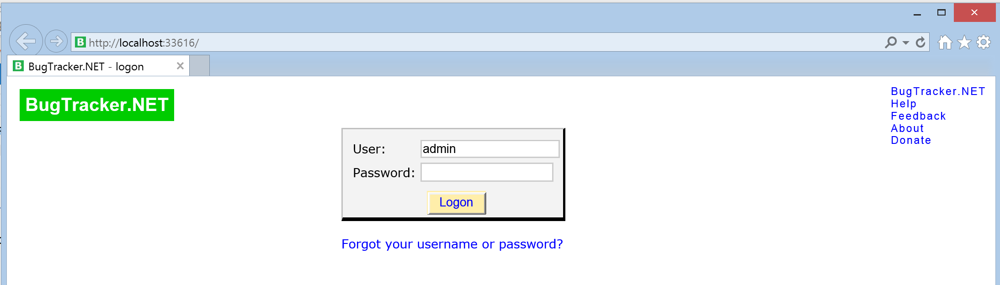

When I look at this page, there are a few things that stand out to me as making the page look a little dated. First, the text inputs seem small. The font size could be bigger and some padding would help make the it easier to hit the target on touch devices. The border styling is a on the button and gray section could also be improved. The user and password text inputs are not the same width which makes the page look a little odd.

One of the great things about Bootstrap is that there are tons of excellent samples and themes that we can use. There are some great examples to get you started on the [main bootstrap site](http://getbootstrap.com/getting-started/#examples). A quick search for [Bootstrap themes](https://www.google.com/webhp?#q=bootstrap+themes) yields a variety of websites dedicated to providing free or very reasonably priced themes that can be used. For our open source project, we will stick with the standard theme. For a business application with a real budget, you may want to consider spending $30 on a good template to make your application look that much more professional.

After adding Bootstrap to our project, the page looks a little strange. This is because some of the CSS from Bootstrap is conflicting with the original BugTracker styling that was applied to the page.

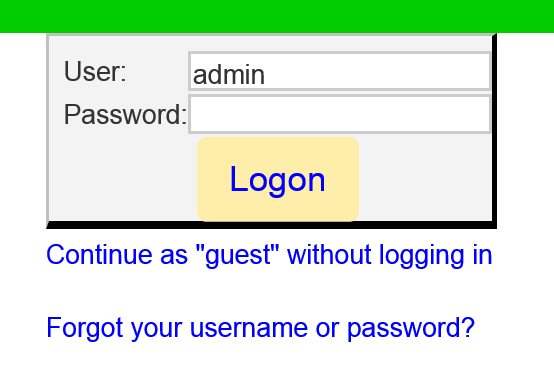

Removing the original styling and adding a modified version of a sample [sign-in template](http://bootsnipp.com/snippets/featured/sign-in-panel), results in a much more modern looking login screen.

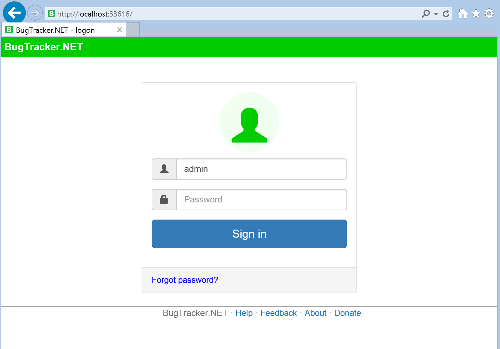

We also moved the Help / Feedback / About links to the footer on the master page. This helps to cleanup the main portion of the login page and also allows us to consistently show those links on all the pages of the application.

Note: The color of the sign in button does not match our application theme. This will require some fine tuning of the Bootstrap theme which we will do shortly.

Another added benefit of using Bootstrap is that the layout can be made to change based on the width of the screen. For narrower devices like phones, we can change the layout to be full screen. Previously, BugTracker.NET was using a special mlogin.aspx page for mobile devices. We can delete that page now because our new login page looks great and works perfectly on mobile devices.

With minimal effort, we were able to change the look and feel of the login page without changing the behavior in any way. All we did was moved some of the markup and added a small amount of CSS.

[View the commit - Bootstrap styling for login page](https://github.com/dpaquette/BugTracker.NET/commit/3ee4a12a256b4edfc6e9e9d6ab471407bb7d297a)

##Bootstrap Theme
The default Bootstrap theme uses blue to represent primary actions. I would like to use the BugTracker.NET green color for primary buttons. We may decide to change that in the future, but we will start with the existing color scheme for now.

You can customize any aspect of Bootstrap by overriding specific CSS rules. There is also a fully featured [theme builder](http://getbootstrap.com/customize/) that you can use to generate custom themes. For now, we will start by adding a new CSS file called `btnet-bootstrap-theme.css`. In that file, we can override the colors for primary buttons:

````
.btn-primary {
  background-image: -webkit-linear-gradient(top, #00cc00 0%, #009900 100%);
  background-image:      -o-linear-gradient(top, #00cc00 0%, #009900 100%);
  background-image: -webkit-gradient(linear, left top, left bottom, from(#00cc00), to(#009900));
  background-image:         linear-gradient(to bottom, #00cc00 0%, #009900 100%);
  filter: progid:DXImageTransform.Microsoft.gradient(startColorstr='#ff00cc00', endColorstr='#ff009900', GradientType=0);
  filter: progid:DXImageTransform.Microsoft.gradient(enabled = false);
  background-repeat: repeat-x;
  border-color: #009900;
}
.btn-primary:hover,
.btn-primary:focus {
  background-color: #009900;
  background-position: 0 -15px;
}
.btn-primary:active,
.btn-primary.active {
  background-color: #009900;
  border-color: #009900;
}
.btn-primary:disabled,
.btn-primary[disabled] {
  background-color: #009900;
  background-image: none;
}
````

We will add more to this file as we customize more of the Bootstrap theme.

On our master pages, we add a link to the new Bootstrap theme directly after the link to the main Bootstrap CSS file.

````
    <link href="Content/bootstrap.min.css" rel="stylesheet" />
    <link href="Content/btnet-bootstrap-theme.css" rel="stylesheet" />
````

[View the commit - Custom Bootstrap theme](https://github.com/dpaquette/BugTracker.NET/commit/d9dc42a6b649c592575ff6ffd0a8ddfa7aa7503c)

Now our button colors are consistent on the login page.

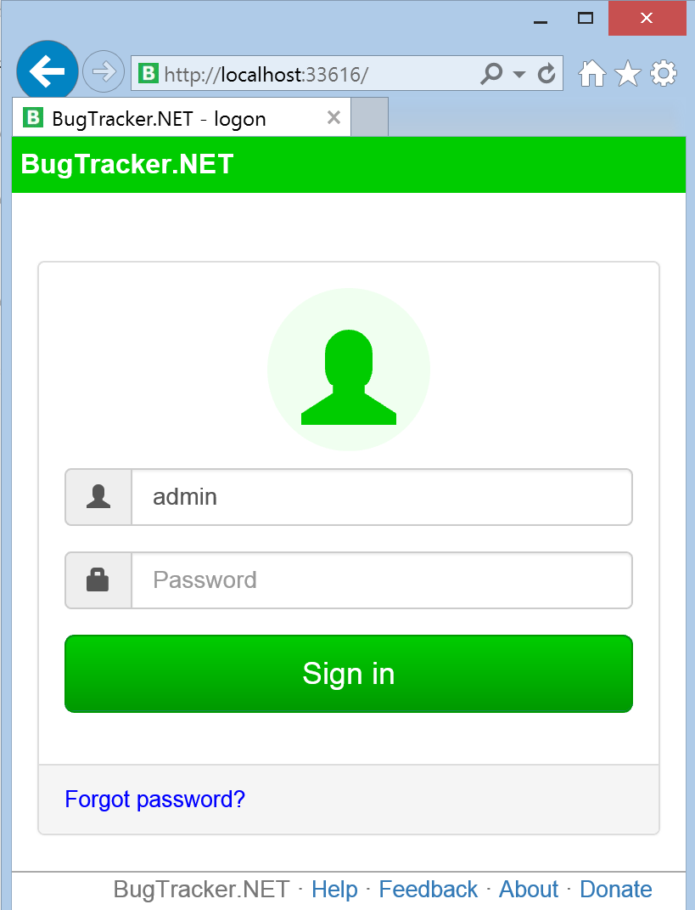

##Bug List Page
Next, we will tackle the layout and styling of the main application page. This is the page that lists out all the bugs that are logged in BugTracker.

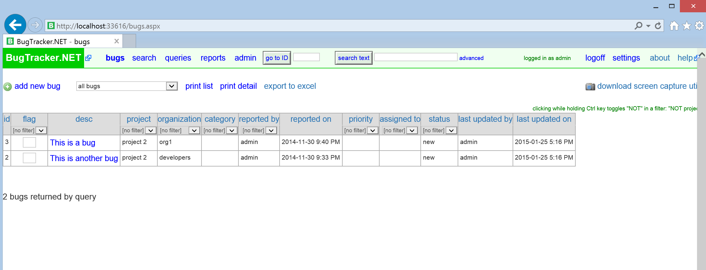

We have a lot of work to do on this page. Let's break it up into a few pieces. The main menu, the bugs sub-menu, the bugs table.

###Main Menu
The main menu is displayed on almost every page of the application. This is an area where we can make some changes that will be visible everywhere. My goal with updating the menu is to make it look less cluttered, more standard, and resize better on smaller screens.

The easiest approach will be to use the navbar component from Bootstrap. We will also make some simple changes to make the layout a little more standard. First off, we will move Logoff and Settings items to a dropdown menu under the user name. This is more consistent with other web applications. We can also remove the About and Help links since those were added to the page footer. This will help to reduce some of the clutter on the main menu.

Here's what the main menu looks like as a standard Bootstrap navbar.

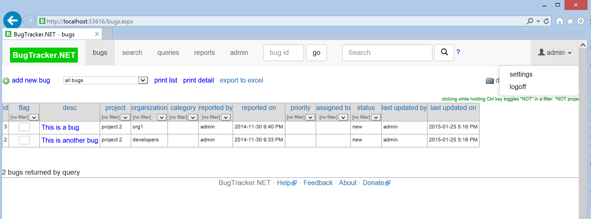

A big benefit of using a Bootstrap navbar is that the navbar is responsive. If the page is resized to be too narrow for the navbar to fit, it will automatically change to a dropdown triggered by a menu (a.k.a. hamburger) icon.

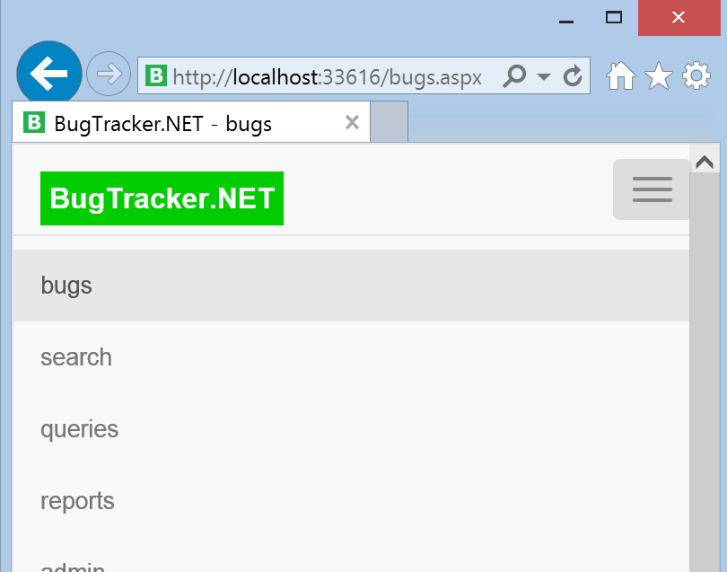

[View the commit - Menu as Bootstrap navbar](https://github.com/dpaquette/BugTracker.NET/commit/82c19279d4b9660286b31c01f4e54d5d82c9d3b8)

The grey menu might work for you. I think in our case it looks a little dull compared to the color that was used in the old menu. With a little more custom theming, we can make the new menu match the BugTracker.NET colors.

````
.navbar-default {
    background-color: #f0fff0;
}
    .navbar-default .navbar-nav > .open > a,
    .navbar-default .navbar-nav > .active > a,
    .navbar-default .navbar-nav > .active > a:hover {
        background-color: #bcffbc;
    }

.navbar-brand {
    padding-top: 10px;
}
````
I also changed the large BugTracker.NET to the smaller icon.

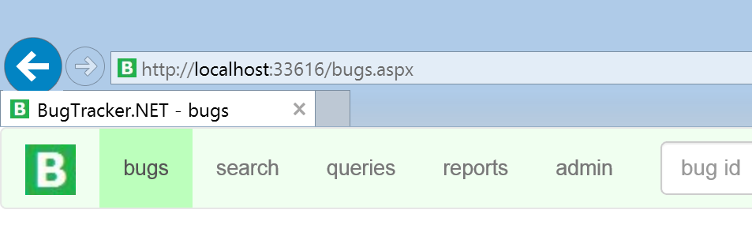

[View the commit - Bootstrap theme for navbar](https://github.com/dpaquette/BugTracker.NET/commit/f03caa8c62db52088c934a5d199379b3eaf7b26d)

###Toolbar
Next, we will restyle the main toolbar that is located above the bugs grid. The toolbar provides quick access to add a new bug, print the list of bugs and export to Excel. We can improve the look of this toolbar simply by converting the links to buttons and adding some icons.

As I start to introduce these changes, I notice that some more css from btnet-base.css is conflicting with the stying of Bootstrap buttons. We can safely delete this CSS and allow Bootstrap to take over styling of buttons.

````
.btn {
	background: #ffeeaa;
	color: #0000ff;
}
````

Likewise, the styling of body, p, td and a several other tags is all causing some inconsistent styling. It is best to keep our custom CSS to a minimum. In the case of BugTracker, we can safefly remove most CSS rules that are setting font sizes or font family.

With the new toolbar, I split out the query dropdown from the other grid bug related actions.

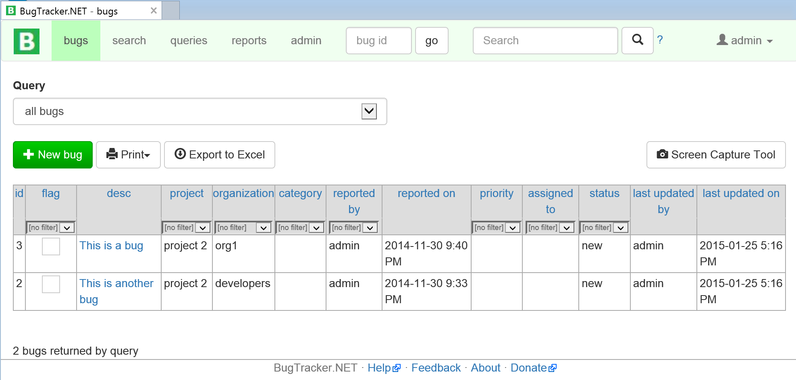

[View the commit - Styling of bugs toolbar](https://github.com/dpaquette/BugTracker.NET/commit/ec6640272d789dfbd2a59e5e6d6bb1bd37a08e74)

###Grid (Data Tables)
So far, we have made very small changes to the actual code. Mostly we have re-arranged the HTML tags and added some CSS classes. Making changes to the grids is a much bigger task because the grids themselves have a lot of behavior associated with them. We will come back to the grids in the near future. For now, I want to get some high impact UI improvements out to our users without too much delay.

##Forms
Next on the list is updating the look of the Add / Edit Bug forms. There are dozens of data forms in BugTracker, but the Add / Edit Bug form is the most commonly used.

Here's what it looks like today.

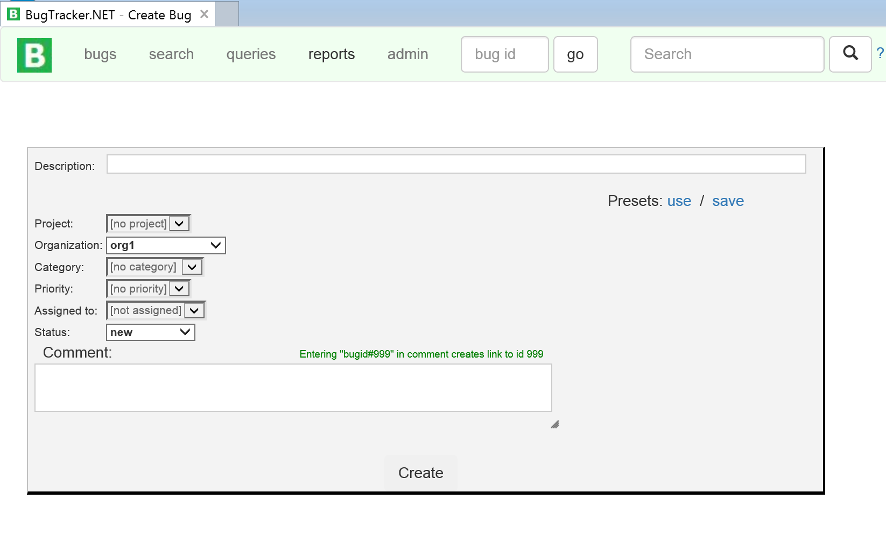

It's not easy to design a forms that are both usable and look great. My goal here isn't to make this form perfect, but I think there are some easy things we can do to improve this form.

We will start by deleting any CSS related to form and input elements from the BugTracker.NET stylesheets.

Next, we will modify the existing form to follow the styling from this basic Bootstrap form template.


````
<form class="form-horizontal">
  <div class="form-group">
    <label for="inputEmail" class="col-sm-2 control-label">Email</label>
    <div class="col-sm-10">
      <input type="email" class="form-control" id="inputEmail" placeholder="Email">
    </div>
  </div>
  <div class="form-group">
    <div class="col-sm-offset-2 col-sm-10">
      <button type="submit" class="btn btn-default">Save</button>
    </div>
  </div>
</form>
````

After moving all the input and select elements to the new Bootstrap form layout, we get a much better looking form.


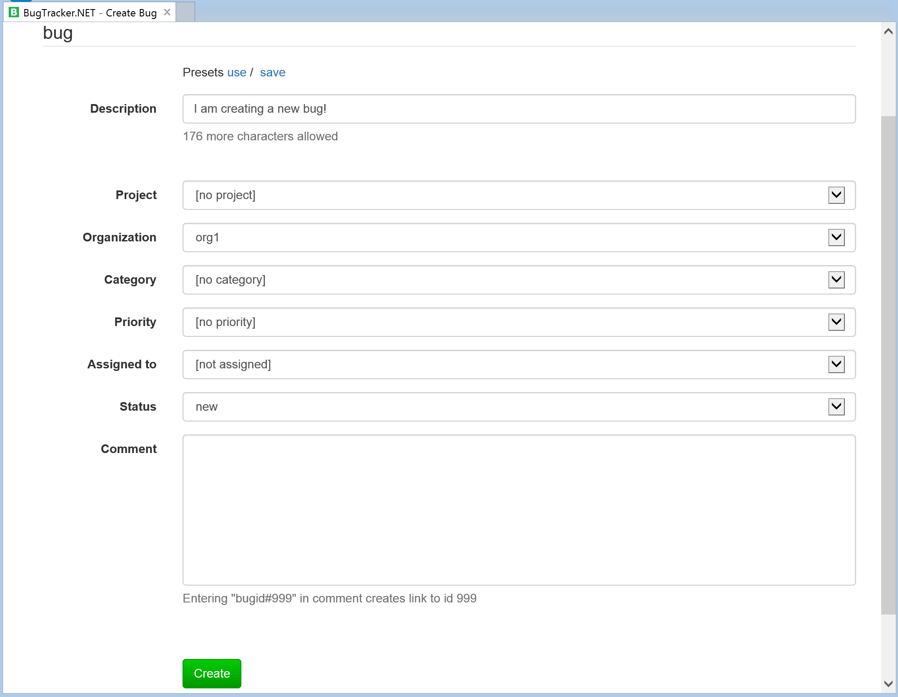

As an added bonus, the responsive Bootstrap layout also looks good on a smaller screens.

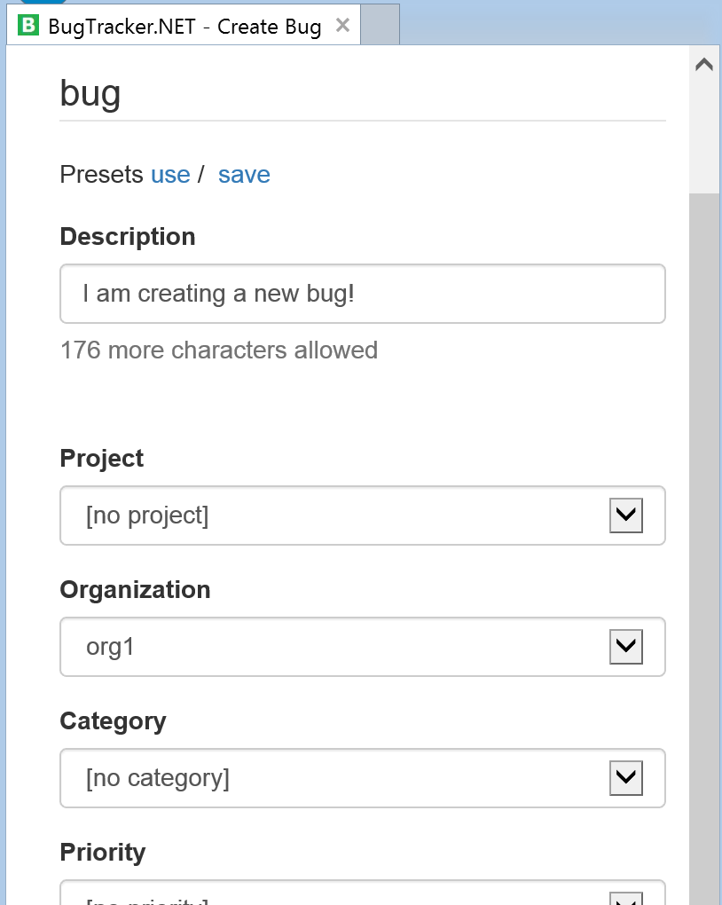

[View the commit - Updated Create Bug form to use Bootstrap layout](https://github.com/dpaquette/BugTracker.NET/commit/a74922469148d02f1c4d7166bf4114ca983ca74f)

Next, we will tackle the Edit Bug screen. It turns out this is the same page as the Create Bug page, but with some sections displayed instead of hidden.

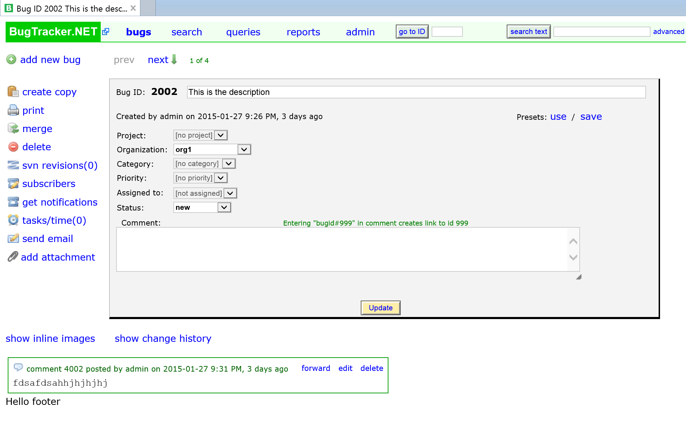

We can use the grid layout from Bootstrap to position the buttons on the left side of the form. After applying some standard button styling and moving a few things around, we end up with a relatively modern and attractive looking Edit Bug form.

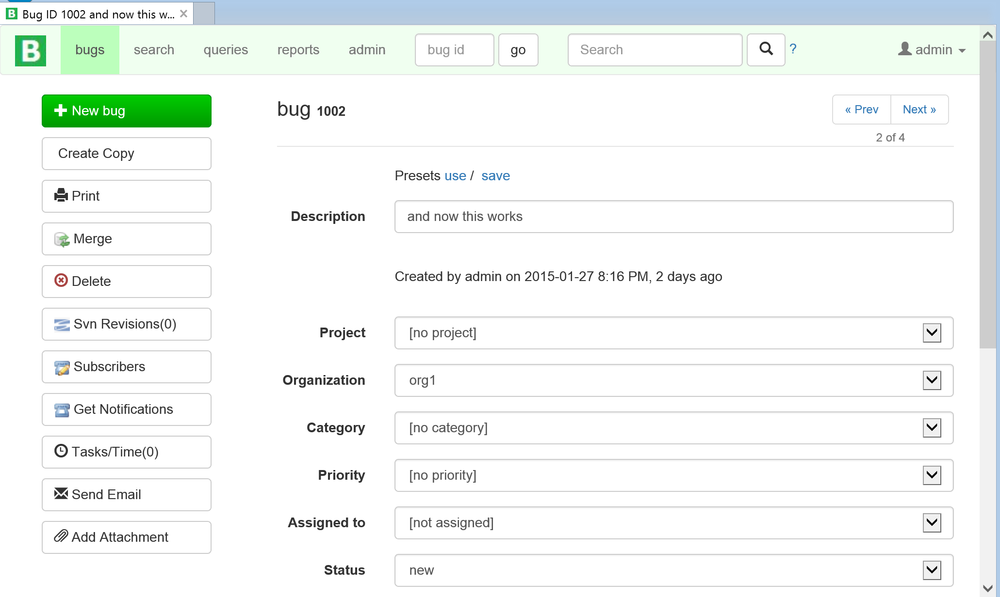

[View the commit - Updated Edit Bug Page](https://github.com/dpaquette/BugTracker.NET/commit/3376407a50e41737c32ae8623743dff99d88d0f4)

While the layout we created here looks fine on a desktop or tablet, things get a little strange on a phone-sized display. The buttons on the left hand side don't really fit on a smaller screen. It sure would be nice if we could collapse this into a dropdown menu when displayed on a narrow screen.

By applying the same approach as we did to the main menu, we are able to collapse the bug toolbar on smaller screens and show the Bug Tools dropdown button instead. It's moments like this that make me glad that frameworks like Bootstrap exist.

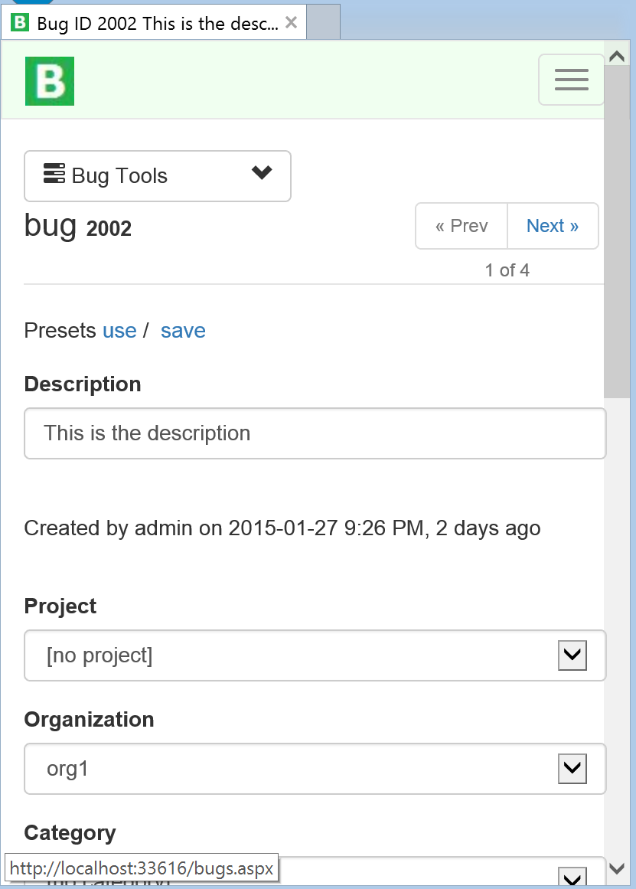

[View the commit - Collapse Edit Bug tools on smaller screen](https://github.com/dpaquette/BugTracker.NET/commit/9297f22e18719d307bc7f4c433b25fdd100592aa)

We could continue to make changes to more pages, but this is probably a good time to publish the update to the application. The changes we made cover the most commonly used pages. Now is a good time to get some feedback from users before applying the styling changes to the remaining application pages.

##Conclusion
With very little effort, we were able to make some high impact improvemnts to the design of a web application that is over a decade old. By using a popular CSS framework, we were able to leverage design expertise from the community without requiring extensive design experience ourselves. As an added bonus, we are  also able to provide a much more pleasant experience for those accessing BugTracker on a mobile devices.
