#Updating the Bugs Grid
In the last section, we showed how easy it is to update some of the simpler grids. In this section, we will take a look at a more complicated example: the bugs grid on the main page.

With the bugs grid, we need to be a little more careful because we could conceivably have 10s of thousands of bugs stored in the system. In this case, we will probably want to use AJAX sourced data instead of DOM sourced like we did in the simple admin grids. If I were to build this system from scratch, I would create a Web API end-point that served JSON data. The client would make HTTP requests to the server, passing search, sorting and paging parameters. The server would pass those parameters to SQL server and all the filtering, sorting and paging would be done in SQL. This is hands down the most efficient way to do this. It minimizes the amount of data passed between the SQL server, the web server and the client. Requests and responses would be small, which would help ensure better throughput for the web server.

##Current Approach

Let's review how the bugs.aspx page works today. Here is a screenshot of the current grid:


Users can interact with this grid in a number of ways. They can select different queries from the Query dropdown. Selecting a different query executes a completely different SQL query and renders a completely different grid with different columns. Clicking on a column header will sort the result set by that column. Some of the columns have dropdowns that allow for filtering. Selecting a value from one of these dropdowns will filter the grid to only rows that match the selected value for that column. If the query returns a large number of bugs, then only 25 bugs will be displayed at a time and links to show the next and previous 25 bugs will be displayed at the bottom of the grid. This is all functionality that we would expect from a data grid in a business application. We are going to want to keep this base level of functionality.

Behind the scenes, this bugs page works by submitting a form back to the bugs.aspx page whenever the user completes one of these actions mentioned above. The form contains hidden fields to indicate which query to execute, which column to sort by and the selected filters. For example, sorting by a particular column will result in a full refresh of the page. This post-back approach is common for older ASP.NET applications but it leads to a less than optimal user experience. Ideally, only the grid itself would update.

```
<input type="hidden" name="new_page" id="new_page" runat="server" value="0" />
<input type="hidden" name="actn" id="actn" runat="server" value="" />
<input type="hidden" name="filter" id="filter" runat="server" value="" />
<input type="hidden" name="sort" id="sort" runat="server" value="-1" />
<input type="hidden" name="prev_sort" id="prev_sort" runat="server" value="-1" />
<input type="hidden" name="prev_dir" id="prev_dir" runat="server" value="ASC" />
<input type="hidden" name="tags" id="tags" value="" />
```
All the filtering, sorting and paging is done on the Web server, not the database server. This is probably acceptable in for many scenarios but it is far from ideal. For example, imagine the grid displays bugs in pages of 25 at a time. What would happen if we had 100,000 bugs in BugTracker and we are trying to display the last 25 bugs in the list of 100,000.

First, the Web server would send a query to the database and load all 100,000 rows in a DataSet in .NET. Immediately we can see some wasted resources here because this is consuming a lot of unnecessary bandwidth between the database and the web server. It will also cause a big spike in memory usage by the web server. Next, the server will create a DataView from the DataSet and apply sorting and filtering. This much less efficient than asking the database to perform these operations. Databases are VERY good at sorting and filtering. DataViews can do an okay job, but they just aren't optimized to the same extend as a database server is. Finally, let's look at the C# code that handles paging.

```
int rows_this_page = 0;
int j = 0;

foreach (DataRowView drv in dv)
{
    // skip over rows prior to this page
    if (j < bugsPerPage * this_page)
    {
        j++;
        continue;
    }
    // do not show rows beyond this page
    rows_this_page++;
    if (rows_this_page > bugsPerPage)
    {
        break;
    }
    //Render the table row
}
```

As you can see, rendering the last page in the table involves iterating through every single row in the table. This is not a responsible use of the web server's CPU. Upon further review of the code, I can see that rendering the grid involves iterating over each row again for each column that contains a dropdown filter. That means that displaying ANY page of a grid involves iterating over every row several times. To make things even harder on server, it appears that the full unfiltered datatable is being stored in session state: `(DataTable)HttpContext.Current.Session["bugs_unfiltered"]`. By storing the datatable in session state, the memory usage won't just spike with each request, it will remain high for every active user session.

The approach used to render this grid might result in acceptable performance for a small number of total bugs and a small number of users, but I don't think it will handle load well. Unlike the admin pages, the bugs page needs to be as efficient as possible. It is the main page of the application and we should expect that every user of BugTracker might be using it at the same time.

Given the current implementation, we can safely assume that the BugTracker deployments do not typically contain thousands of active bugs or thousands of active users. Regardless, I would like to aim for better performance with the bugs grid. The current implementation is also difficult to understand. Let's see if we can both improve the performance and maintainability of this code.

#Filtering, Sorting and Paging in SQL
One of the biggest challenges here is the fact that this page can execute arbitrary queries that return any number of columns. This seems to be an important extensibility point in BugTracker so I would like to keep this feature.

If we want to handle filtering, sorting and paging on the database server, then we will to extend the BugTracker queries feature.

The base installation of BugTracker contains about 10 different queries that can be executed on the bugs.aspx page. These can be added to by administrators, but they all look a little something like this:

```
select isnull(pr_background_color,'#ffffff') as bg_color, bg_id [id], isnull(bu_flag,0) [$FLAG],
 bg_short_desc [desc], isnull(pj_name,'') [project], isnull(og_name,'') [organization], isnull(ct_name,'') [category], rpt.us_username [reported by],
 bg_reported_date [reported on], isnull(pr_name,'') [priority], isnull(asg.us_username,'') [assigned to],
 isnull(st_name,'') [status], isnull(lu.us_username,'') [last updated by], bg_last_updated_date [last updated on]
 from bugs
 left outer join bug_user on bu_bug = bg_id and bu_user = @ME
 left outer join users rpt on rpt.us_id = bg_reported_user
 left outer join users asg on asg.us_id = bg_assigned_to_user
 left outer join users lu on lu.us_id = bg_last_updated_user
 left outer join projects on pj_id = bg_project
 left outer join orgs on og_id = bg_org
 left outer join categories on ct_id = bg_category
 left outer join priorities on pr_id = bg_priority
 left outer join statuses on st_id = bg_status
```

In order to support sorting, filtering and paging on in SQL along with dynamic queries like this, we will need to make some compromises in terms of the query.

We can achieve this by dynamically writing a query that wraps the original query and applying sorting, filtering and paging using some SQL parameters. An abbreviated example of the query above would look something like this:

```
SELECT * FROM (
  select bg_id [id], isnull(pj_name,'') [project], isnull(og_name,'') [organization]
   from bugs
   left outer join projects on pj_id = bg_project
   left outer join orgs on og_id = bg_org
   ) t
 WHERE (@organization_filter IS NULL OR t.[organization] = @organization_filter)
 AND (@project_filter IS NULL OR t.[project] = @project_filter)
 order by [id] ASC
OFFSET @offset ROWS
FETCH NEXT @page_size ROWS ONLY;
```

There are a some important things to point out about this query. First, I am using the OFFSET and FETCH syntax which was introduced in SQL Server 2012. If we needed to support older versions of SQL Server, the same result could be accomplished using the ROW_NUMBER approach. Also, the query is not optimal. For example, it would be far more optimal to apply the WHERE clause to the inner query against the id of organization table rather than applying it against the organization name on the outer query. This is a trade-off I am willing to make to allow for the existing extensibility and we will do some tests to ensure performance of the new approach is still acceptable.

##Wrapping the existing queries
To wrap the existing queries, I created a new class called `BugQueryExecutor`. This class takes in an instance of the existing queries and dynamically builds the wrapping query with the filtering, sorting and paging applied. Calling execute will return a datatable with only a the rows for specified page. It will also return a count of the total number of rows before and after filtering was applied. This will be useful so we know when to show the Next / Prev buttons and to give the user some indication of how many bugs were returned by the query vs. the number of bugs that are actually stored in BugTracker.

```
public class BugQueryExecutor
{
    private readonly Query _query;
    private readonly string[] _columnNames;
    private const int MaxLength = 5000;

    public BugQueryExecutor(Query query)
    {
        _query = query;
        _columnNames = query.ColumnNames;
    }

    public BugQueryResult ExecuteQuery(IIdentity identity, int start, int length, string orderBy,
        string sortDirection, BugQueryFilter[] filters = null)
    {
        return ExecuteQuery(identity, start, length, orderBy, sortDirection, false, filters);
    }

    public BugQueryResult ExecuteQuery(IIdentity identity, int start, int length, string orderBy, string sortDirection, bool idOnly, BugQueryFilter[] filters = null)
    {
        if (!string.IsNullOrEmpty(orderBy) && !_columnNames.Contains(orderBy))
        {
            throw new ArgumentException("Invalid order by column specified: {0}", orderBy);
        }
        string columnsToSelect = idOnly ? "id" : "*";
        var initialSql = string.Format("SELECT t.{0} FROM ({1}) t",columnsToSelect, GetInnerSql(identity));
        SQLString sqlString = new SQLString(initialSql);
        var initialCountSql = string.Format("SELECT COUNT(*) FROM ({0}) t", GetInnerSql(identity));
        SQLString countSqlString = new SQLString(initialCountSql);
        SQLString countUnfilteredSqlString = new SQLString(initialCountSql);
        int userId = identity.GetUserId();
        sqlString.AddParameterWithValue("@ME", userId);
        countSqlString.AddParameterWithValue("@ME", userId);
        countUnfilteredSqlString.AddParameterWithValue("@ME", userId);


        if (filters != null && filters.Any())
        {
            ApplyWhereClause(sqlString, filters);
            ApplyWhereClause(countSqlString, filters);
        }

        sqlString.Append(" ORDER BY ");

        sqlString.Append(BuildDynamicOrderByClause());

        sqlString.AddParameterWithValue("ORDER_BY", orderBy ?? _columnNames.First());
        sqlString.AddParameterWithValue("SORT_DIRECTION", sortDirection);


        sqlString.Append(" OFFSET @offset ROWS FETCH NEXT @page_size ROWS ONLY");
        sqlString.AddParameterWithValue("page_size", length > 0 ? length : MaxLength);
        sqlString.AddParameterWithValue("offset", start);


        return new BugQueryResult
        {
            CountUnfiltered = Convert.ToInt32(DbUtil.execute_scalar(countUnfilteredSqlString)),
            CountFiltered = Convert.ToInt32(DbUtil.execute_scalar(countSqlString)),
            Data = DbUtil.get_dataset(sqlString).Tables[0]
        };

    }

    private string BuildDynamicOrderByClause()
    {
        return string.Join(", ",
            _columnNames.Select(column => string.Format(
                @" CASE WHEN @ORDER_BY = '{0}' AND @SORT_DIRECTION = 'DESC' THEN [{0}] END DESC,
CASE WHEN @ORDER_BY = '{0}' AND @SORT_DIRECTION = 'ASC' THEN [{0}] END ASC", column)).ToArray());
    }

    private void ApplyWhereClause(SQLString sqlString, BugQueryFilter[] filters)
    {
        sqlString.Append(" WHERE ");
        List<string> conditions = new List<string>();
        foreach (var filter in filters)
        {
            if (!_columnNames.Contains(filter.Column))
            {
                throw new ArgumentException("Invalid filter column: {0}", filter.Column);
            }
            string parameterName = filter.Column;
            conditions.Add(string.Format("[{0}] = @{1}", filter.Column, parameterName));
            sqlString.AddParameterWithValue(parameterName, filter.Value);
        }
        sqlString.Append(string.Join(" AND ", conditions));
    }

    private string GetInnerSql(IIdentity identity)
    {
        SQLString innerSql = new SQLString(_query.SQL);
        return Util.alter_sql_per_project_permissions(innerSql, identity).ToString();
    }

}
```

In addition to filtering, sorting and paging, this class also applies any user specific project permissions.

[View the commit - Created Bug Query Executor](https://github.com/dpaquette/BugTracker.NET/commit/5274b512db3d5223e41b423b615649723954712b)

Some of the existing queries needed to change slightly to support this. Specifically, the BugQueryExecutor needs to now the list of columns returned by each query. I added an update script to update all the known queries. Any other custom queries will need to be updated by the system administrator.

[View the commit - Updated known queries](https://github.com/dpaquette/BugTracker.NET/commit/2f1ce8e0246c0e4074c99aa5ae24d04005169017)

##Adding Web API
Now that we have added improved bug querying support, we need to expose a way for the application to call and execute the queries without requiring a full page refresh. Since we are planning to use jQuery DataTables, the easiest option will be to expose an HTTP endpoint that returns the data in JSON format. Since this type of scenario is exactly what Web API was designed, I see this as a perfect opportunity for us to introduce Web API.

First, create a folder named Controllers. By convention, this is where we add Web API controllers. In Web API, controllers are simple classes that handle HTTP requests. Right click on the new Controllers folder and select Add Controller. Select Web API 2 Controller - Empty from the list of options and name the new controller BugQueryController. Visual Studio will add the references to Web API and provide instructions on how to complete the Web API configuration. Follow those instructions by adding `GlobalConfiguration.Configure(WebApiConfig.Register);` to the Application Start method of global.asax.cs.

That's it! We can use Web API in our project.

[View the commit - Added Web API](https://github.com/dpaquette/BugTracker.NET/commit/5c182f13bc1ade3de5037a8e528df7075a2a7f6a)

From the new BugController now, we can add a method that calls the new BugQueryExecutor and returns the results in a format that will be convenient for jQuery DataTables. We also add the Authorize attribute to the BugQueryController. This ensures that only logged in users can access the data from this HTTP endpoint.

```
[Authorize]
public class BugQueryController : ApiController
{
  public IHttpActionResult Get(int queryId, string sortBy, string sortOrder, int start, int length, [FromUri] BugQueryFilter[] filters)
  {
      Query query;
      using (Context context = new Context())
      {
          query = context.Queries.Find(queryId);
      }
      if (query != null)
      {
          BugQueryExecutor queryExecutor = new BugQueryExecutor(query);
          var result = queryExecutor.ExecuteQuery(User.Identity, start, length, sortBy, sortOrder, filters);
          return Ok(new
              {
                  recordsTotal = result.CountUnfiltered,
                  recordsFiltered = result.CountFiltered,
                  data = result.Data
              });
      }
      return NotFound();
  }
}
```
The parameters on the get method correspond to the hidden fields that were used in the original bugs.aspx form.

By default, Web API is configured to use JSON.NET to serialize the result as JSON. Magically, JSON.NET knows how to serialize a `DataTable` so we didn't need to do any extra work here.

##Replacing the Bugs Table
Now that we have all the backend pieces we need, we can finally replace the bugs table on bugs.aspx with a new jQuery DataTables.

Luckily, jQuery DataTables is extremely flexible, making it relatively easy to configure it to call our Web API endpoint to get data.

Rather than placing the bugs grid implementation directly in the bugs.aspx page, I added a new user control called BugList.ascx. By extracting the implementation to a user control, it gives us the option to potentially re-use it else where in the application.

The markup for this user control simply generates the shell for the table based on the columns that for the selected query. This includes a header with 2 rows: One for the column name and a second row for any filter dropdowns.
```
<table id="bug-table" class="table table-striped table-bordered">
    <thead>
        <!--Main header-->
        <tr>
            <%foreach (string columnName in GetVisibleColumns())
              {%>
            <th><%= GetColumnDisplayName(columnName) %></th>

            <%}%>
        </tr>
        <!--Filter row-->
        <tr class="filter-row">
            <% foreach (string columnName in GetVisibleColumns())
               {%>
            <th><% if (IsFilterableColumn(columnName))
                   {%>
                <select class="table-filter" data-column-name="<%=columnName %>">
                    <% foreach (var option in GetFilterValues(columnName))
                       {%>
                    <option value="<%=option.Value %>"><%=option.Text %></option>
                    <%}%>
                </select>

                <%} %></th>

            <%}%>
        </tr>
    </thead>
</table>
```

Based on the existing logic, only certain columns are visible and a subset of those columns are filterable. I extracted this logic from the old static utility methods and placed them in the code behind for the user control.

Finally, I added the following JavaScript to the BugList control to actually render the grid:

```
$(function() {
    ///Special column rendering functions not shown for brevity.

    var getCurrentFilters = function() {
      var filters = [];
      $("select.table-filter").each(function() {
          var currentFilter = $(this);
          var selectedValue = currentFilter.val();
          if (selectedValue) {
              var selectedColumnName = currentFilter.attr('data-column-name');
              filters.push({Column: selectedColumnName, Value: selectedValue});
          }
      });
      return filters;
    };

    var bugsTable = $("#bug-table").dataTable({
        serverSide: true,
        processing: true,
        paging: true,
        orderCellsTop : true,
        orderMulti: false,
        searching: false,
        ajax: function(data, callback) {
            var sortColumnName = data.columns[data.order[0].column].data;
            var urlParameters = {
                queryId : queryId,
                sortBy : sortColumnName,
                sortOrder : data.order[0].dir,
                start: data.start,
                length: data.length,
                idOnly: false,
                filters: getCurrentFilters()
            }
            BugList.setQueryParams(urlParameters);
            var queryUrl = "api/BugQuery?" + $.param(urlParameters);

            $.get(queryUrl).done(function(d) {
                callback(d);
            }).fail(function() {
                callback();
            });
        }
    }).api();

    //Force a refresh after any of the filters are changed
    $("select.table-filter").on("change", function() {
        bugsTable.draw();
    });
});
```
By specifying an `ajax` function for the dataTable configuration, we are able to tell jQuery DataTables exactly how to call our new Web API method. There is also some custom column rendering logic that was migrated over from the old static utility methods. These are not shown above for brevity. While some of this JavaScript might look a little overwhelming, it did allow us to delete a lot of complex code from the bugs.aspx page. It will also eventually allow us to delete a large amount of very hard to understand code from bug_list.js and bug_list.cs.

Here is what the new grid looks like:
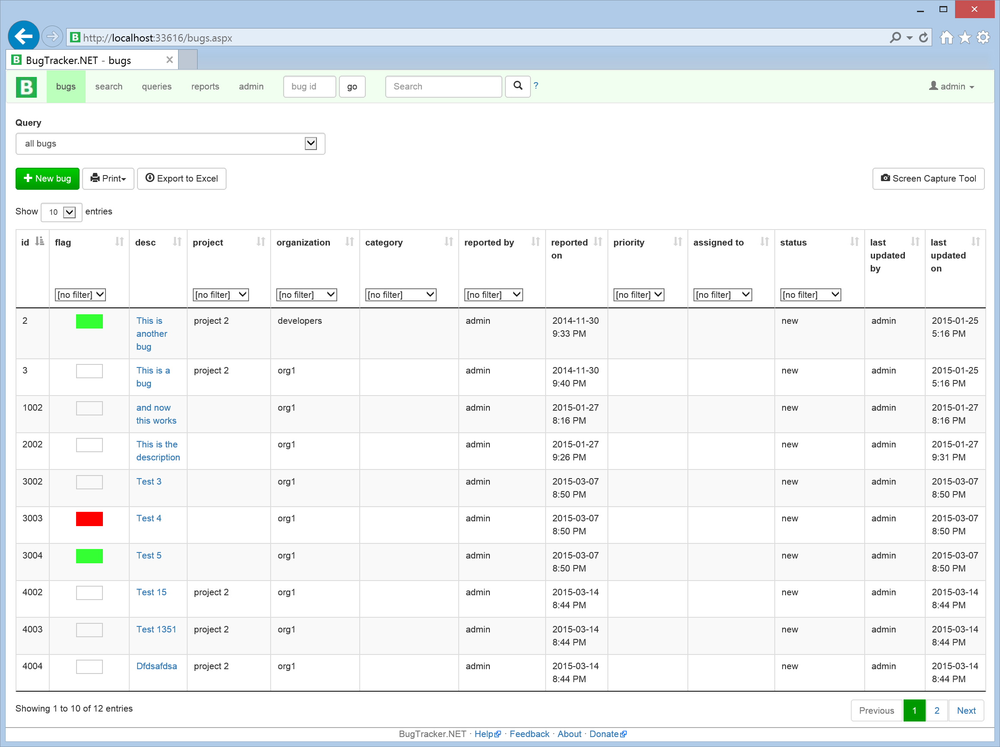

The columns are a little narrow to fit them all on the page, but the overall look and feel is improved. The biggest improvement for the user is that any sort, filter or paging action no longer triggers a full page refresh. The page generally *feels* snappier.

[View the commit - Updated Bugs page to use jQuery DataTables](https://github.com/dpaquette/BugTracker.NET/commit/c026cb54f69e00ec1860574f20270e3e4a85d7d8)

##Grid Related Functionality
At this point, I thought I was done. Unfortunately, there was are a handful of features that relied on the old data grid implementation and are now broken with the new approach.

Specifically, a few features were relying on the following code from bugs.aspx:

```
Session["bugs"] = dv;
Session["SelectedBugQuery"] = qu_id_string;

if (ds != null)
{
    Session["bugs_unfiltered"] = ds.Tables[0];
}
else
{
    Session["bugs_unfiltered"] = null;
}
```

After executing a query, both the filtered and unfiltered results were stored in session state. This was used by the print list, print details and export to Excel features to get the list of bugs without re-querying the database. It was also used by the edit bug page to display links to the previous and next bugs in the query results.

While this may be convenient for the developer, it will be hard on the web server's memory. Let's start by fixing these features so they work with the new implementation, then we can compare memory and CPU usage for before and after.

###Printing & Exporting to Excel
When the user selects the print option from the bugs page, they are taken to a simple page that lists all the bugs from the current query in an HTML table that is formatted for printing. This page does not have the BugTracker header or footer. Previously, this page would get the list of bugs from session state:

```
dv = (DataView)Session["bugs"];
```

The markup for the print page simply iterates over all the bugs in this DataView and output them to an HTML table. This DataView that was stored in session state contained all the bugs, not only the bugs for the current page of bugs.

In the new version, the server does not keep track of the query results in session state. Even the client does not have a list of all the bugs. The client only has a reference to the bugs for the current page. The only way for us to get a list of all the bugs is to have the client pass all the current bug query parameters (queryId, sort column/direction and selected filters) to the print page. The print page can then use the BugQueryExecutor to get a list of all the bugs. Once we have the results from the BugQueryExecutor, the markup for the print page can remain unchanged.

First, let's have the client keep track of the currently selected query parameters by storing it in sessionStorage. Session storage is a local key-value store that is available in all browsers since IE8. It is a convenient way for the client to remember information between page requests without storing large amounts of data in cookies.

```
var BugList = (function() {
    var setQueryParams = function(queryParams) {
       sessionStorage.setItem("BugQuery", JSON.stringify(queryParams));
    };
    var getQueryParams = function() {
         return JSON.parse(sessionStorage.getItem("BugQuery"));
    };

  return {
    setQueryParams: setQueryParams,
    getQueryParams: getQueryParams
   }
 }());

```

Now in the BugsList.ascx control, we can set the query parameters whenever the data grid is refreshed:

```
ajax: function(data, callback) {
                var sortColumnName = data.columns[data.order[0].column].data;
                var urlParameters = {
                    queryId : queryId,
                    sortBy : sortColumnName,
                    sortOrder : data.order[0].dir,
                    start: data.start,
                    length: data.length,
                    filters: getCurrentFilters()
                }
                BugList.setQueryParams(urlParameters);
                var queryUrl = "api/BugQuery?" + $.param(urlParameters);

                $.get(queryUrl).done(function(d) {
                    callback(d);
                    BugList.saveCurrentBugList(d);
                }).fail(function() {
                    callback();
                });
            }
```

When the user clicks the Print button, we can get the current query parameters and pass those as parameters to the print_bugs.aspx page.

```
$(function() {
    var printBugs  = function(baseUrl) {
        var queryParams = BugList.getQueryParams();
        if (queryParams != null && queryParams.queryId) {
            queryParams.start = 0;
            queryParams.length = -1; //Get all the bugs instead of just 1 page
            window.open(baseUrl + $.param(queryParams), "_blank");
        }
    }

    $("#printbuglist").click(function() {
        printBugs("print_bugs.aspx?");
        return false;
    });
});
```

In the code behind for print_bugs.aspx, we use the parameters to execute a query and get the list of bugs to print.

```
int queryId = Convert.ToInt32(Request["queryId"]);
int start = Convert.ToInt32(Request["start"]);
int length = Convert.ToInt32(Request["length"]);
string sortBy = Request["sortBy"];
string sortOrder = Request["sortOrder"];
BugQueryFilter[] filters = BuildFilter(Request.Params);
Query query;
using (Context context = new Context())
{
    query = context.Queries.Find(queryId);
}

BugQueryExecutor executor = new BugQueryExecutor(query);

BugQueryResult result = executor.ExecuteQuery(User.Identity, start, length, sortBy, sortOrder, filters);

dv = new DataView(result.Data);
```

The design was exactly the same for the Export to Excel and Print Details features. Repeating the same fix solved those problems:

[View the commit - Print and Export to Excel without session state](https://github.com/dpaquette/BugTracker.NET/commit/aa379c222f91c2bf9cd1d1f59c7ade0d954b090f)

###Navigating through individual results
Clicking a bug in the bug table takes you to the Edit Bug page. This page shows the details for the selected bug and also shows links to the previous and next bugs in the query the user was viewing on the bugs page.

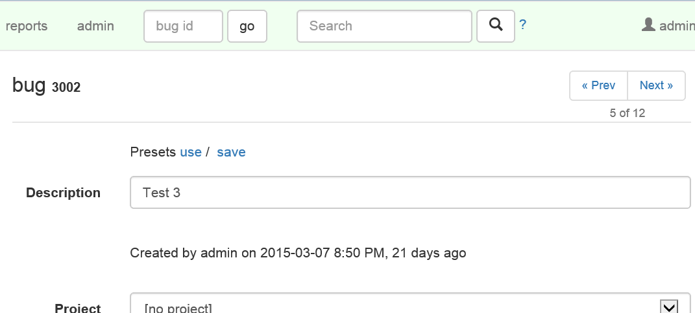

This provides a very convenient way for the user to navigate through the list of bugs they were viewing on the main page. Unfortunately this is now broken because the implementation relied on the bugs being stored in session state.

We can move some this logic over to the client side by storing a list of the bug ids from the current query in session storage, similar to the way we stored the current query parameters:

```
var saveCurrentBugList = function (queryResults) {
    var currentBugList = {
        recordsFiltered: queryResults.recordsFiltered,
        bugIds: []
    };

    if (queryResults.data) {
        var bugList = queryResults.data;
        for (var i = 0; i < bugList.length; i++) {
            currentBugList.bugIds.push(bugList[i].id);
        }
    }

    sessionStorage.setItem("BugList", JSON.stringify(currentBugList));
}

var getCurrentBugList = function () {
    return JSON.parse(sessionStorage.getItem("BugList"));
}
```

On the bugs page, we can look for the current bug in the list of bugs. If the bug is found in the list, then we can display the Previous / Next bug links in the same was as before. All we did was move that logic from the server to the client. There is some additional complexity around getting the next or previous list of bug ids when there is more than one page of bugs. This can be handled in JavaScript by calling the BugQuery Web API endpoint when necessary.

[View the commit - Prev/Next bug links without session state](https://github.com/dpaquette/BugTracker.NET/commit/1249de58648261d5627fe797ad8d3b2eedda4336)

##Comparing Performance
Creating performance benchmarks is hard. There are so many variables that can affect performance that it can be nearly impossible to get consistent results. Difficulty aside, I made some claims that the original data grid implementation was not optimal and that our new implementation would be more efficient. I would like to at least attempt to prove this with some repeatable load tests.

###Setting up the Environment
The first step is to create an environment were we can compare the performance of the old and new implementations. To do this, I switched back to the *master* branch to get a copy of the BugTracker with the original data grid implementation. I took a compiled version of this and deployed it as a web application on my local IIS. I called this application *btnetold* and assigned it to a new application pool by the same name. Next, I switched back to the *Data_Grid_Update* branch to get a copy of the new implementation. I compiled this version and deployed it to a web application called *btnetnew*, also with a new application pool by the same name. I now have the old and new applications installed into IIS. I am able to turn each version on/off by starting and stopping the individual application pools. Both instances are configured to use the same database instance which is also hosted on my local machine.

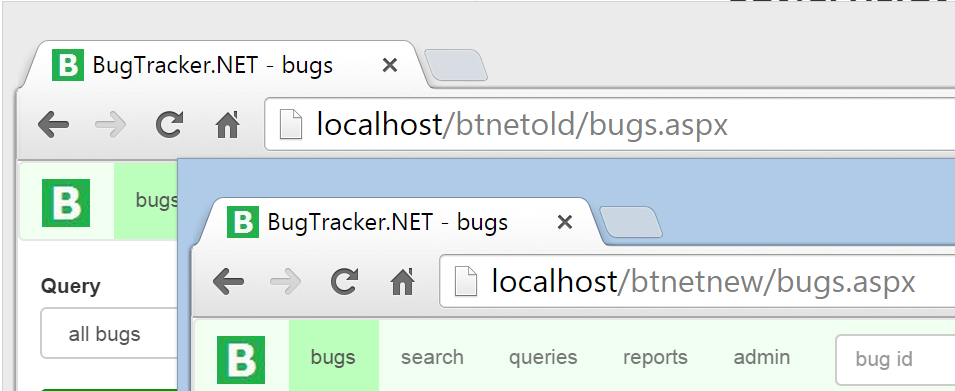

###Designing the Tests
Before designing the tests, it is important to establish what exactly it is we would like to measure. My predictions are that the original implementation will require more CPU and more RAM to process the same number of requests. Based on what we saw in the code, I also predict that the CPU and RAM requirements will increase significantly based on the number of bugs stored in the BugTracker database. If all goes as planned, the new implementation should require a lot less CPU and RAM to handle the same amount of load (active users and bugs in the database). Another way of putting this is that the new implementation should be capable of serving a larger number of active users without requiring a hardware upgrade.

At first, I tried to test these assumptions by inspecting the timing, CPU usage and memory usage while manually browsing the *btnetold* and *btnetnew* instances. Unfortunately, it was difficult to see a substantial difference between the two implementations when only a single users was using the application. What I needed was a way to simulate a larger number of users interacting with BugTracker at the same time. There are a number of load testing tools available, including [Test Studio](http://www.telerik.com/teststudio/load-testing) by Telerik and [Load Complete](http://smartbear.com/product/loadcomplete/overview/) by SmartBear. If you  have a Visual Studio Ultimate (or Enterprise) license, you can use the Visual Studio Load Tester like I did here.

First, I added a new Web Performance and Load Test Project to the BugTracker solution.

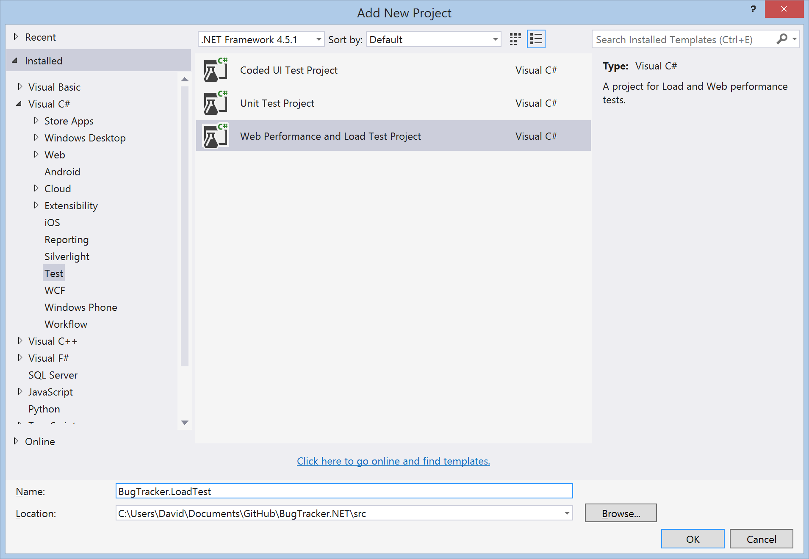

Next, we need to create some tests that simulate a user interacting with the two implementations. To do this, I added a new Web Performance Test to the test project. This opens Internet Explorer with the Web Test Recorder plugin started. In Internet Explorer, I can browse to a particular URL and perform the actions you want the use in your load test and the Web Test Recorder will record these actions.

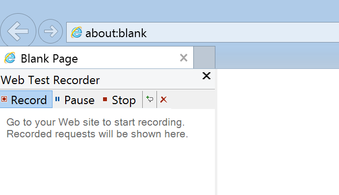

I performed the following actions on the *btnetold* instance:
- Login to BugTracker
- Click the Next Page link 5 times to test paging actions
- Click the Description column to test sorting
- Select a project from the projects column filter to test filtering
- Click the Next Page link 4 times to test paging with filtering and sorting applied
- Click the Previous Page link to test navigating to a previous page

After completing these actions, I clicked the Stop button in the Web Test Recorder plugin. This takes me back to Visual Studio where I can review the actions that were recorded. The web test recorder keeps track of all the HTTP requests so they can be played back. You can run the test once by clicking the Run Test button. After reviewing the actions and ensuring that they appear to be correct, I saved this test as OldGrid.webtest. The requests consist mostly of post requests to the bugs.aspx page. Each post request has different form post values corresponding to the different actions I performed in Visual Studio.

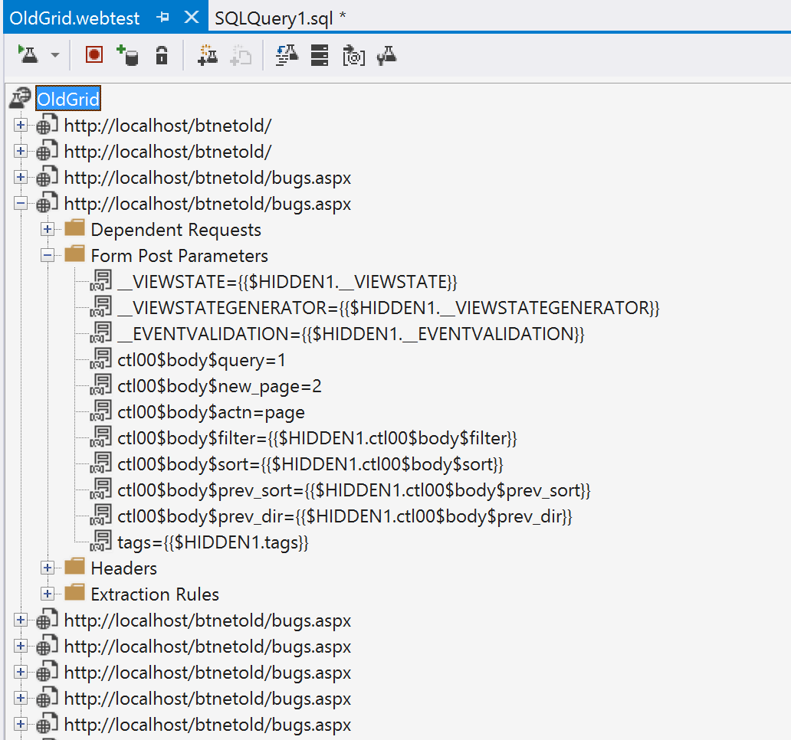

If the changes we were testing had been limited to backend processing chances, we could simply add a parameter to the Web Test and run it against both the *btnetold* and *btnetnew* instances. Unfortunately, this won't work in our case because the changes involved drastic changes to the web requests themselves. The post requests to bugs.aspx won't work with the new implementation. Instead, we need to create a new web test specifically for the new version. I repeated the process above for the *btnetnew* instance. The resulting web test file is very similar but contains get requests to the api/BugQuery endpoint instead of the post requests to bugs.aspx.

The next step is to create a load test that can execute the individual tests we created to simulate a larger number of simultaneous users. To do this, I added a new Load Test to the test project. This opens the Load Test wizard which will guide you through the design of a load test. There are a number of options here that allow you to simulate very different scenarios. In particular, I was interested in seeing how the system would react to an increasing number of users performing the set of recorded grid actions at regular interval.

I called this load test scenario Old Grid and selected the *Do not use think times*. Think time refers to the amount of time that was taken between each of the steps recorded in the web test. By selecting Do not use think times, the load test runner will run the next step immediately after the current step is completed. I did not want to use think times because the recorded times are likely different between the old grid and new grid tests that I created. If the load test were to play the actions back with different timings, then we wouldn't be making a fair comparison.
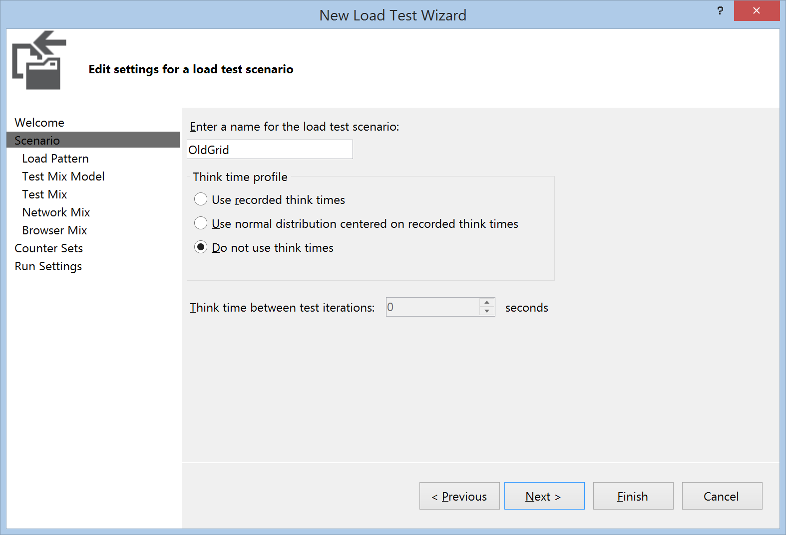

In the next step, we are given options of how to simulate the load pattern. I chose to start with 10 users and increase the number of users by 10 every 10 seconds until we reach 200 users. This should allow us to see how BugTracker's CPU usage, memory usage and response time change as the number of users increases.


The next step in defining our load test is to select a test mix pattern. The test mix pattern defines how the load test runner will decide the frequency of each test per simulated user. Most of the options will simply repeat the tests in sequence as many times as possible in the given amount of time. These options are good for testing overall throughput of a server but are not as good at comparing the resource requirements of 2 different implementations. I chose the Based on User Pace option, which will allow us to specify how often each simulated user should execute a specific test.
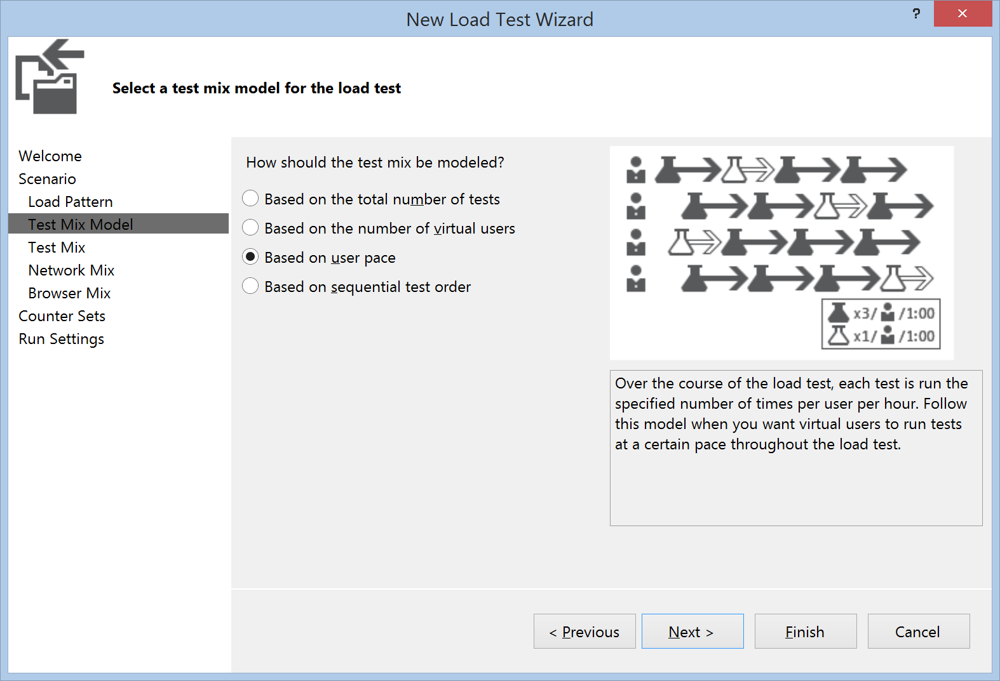

In the Test List, I added the Old Grid test and selected a pace of 60 times per hour, which is just a confusing way of saying each user should execute this test once every minute.
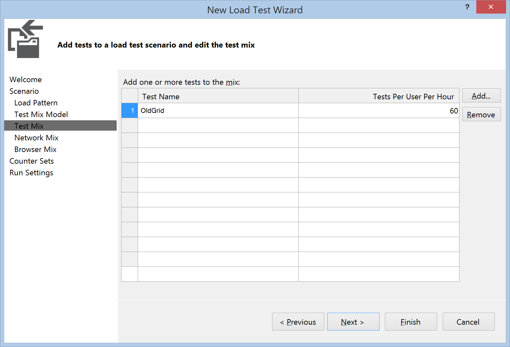

The Network Mix step allows you to simulate different network situations. I chose LAN because I am not particularily interested in seeing how the server behaves when clients are connected on slower connections. Likewise, the Browser Mix step allows you to select from a variety of different browsers. I chose Internet Explorer 11 because we are not interested in testing different browsers here.

Finally, in the Run Settings step, I chose a warm-up time of 30 seconds and a run time of 5 minutes. The 30 second warm-up time helps to remove any noise related to application startup time which is not what we are trying to test here.
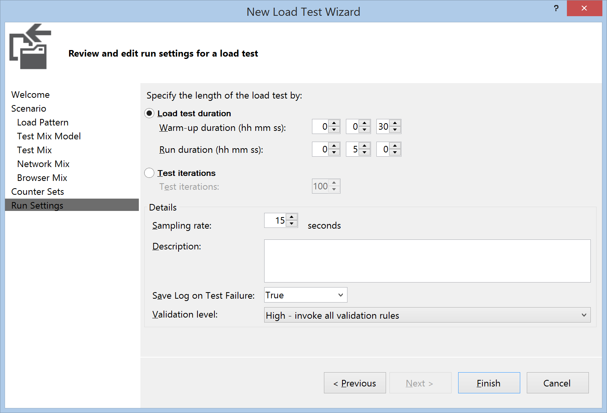

I saved this as OldGridPace.loadtest and added a new Load Test for the NewGrid scenario, saving that test as NewGridPace.loadtest. With the tests created we can finally move ahead to finally running the tests.

###Running the Tests
When I first tried running these tests, I was getting very inconsistent results. After doing some investigation, I noticed that other processes on my machine were using large amounts of my CPU and affecting the results. After disabling the Windows Search Indexer local service, turning off Windows Defender (anti-malware service) and pausing OneDrive syncing, I was able to get much more consistent results.

I repeated the tests for both instances 4 times with 100 bugs, 1,000 bugs, 10,000 bugs and 100,000 bugs to see how the performance characteristics would change as the number of bugs in the database increased. For each of the test runs, I would start the *btnetold* application pool, stop the *btnetnew* application pool and run the OldGridPace load test. Once that test completed, I would stop the *btnetold* application pool, start the *btnetnew* application pool and run the NewGridPace load test.

[View the commit - Load Tests](https://github.com/dpaquette/BugTracker.NET/commit/b7cd20be426f315dc42c5c5ec1189b95faf30ba4)

###Analyzing the Results

The load test runner in Visual Studio gives some nice looking graphs and summary information for each test run.

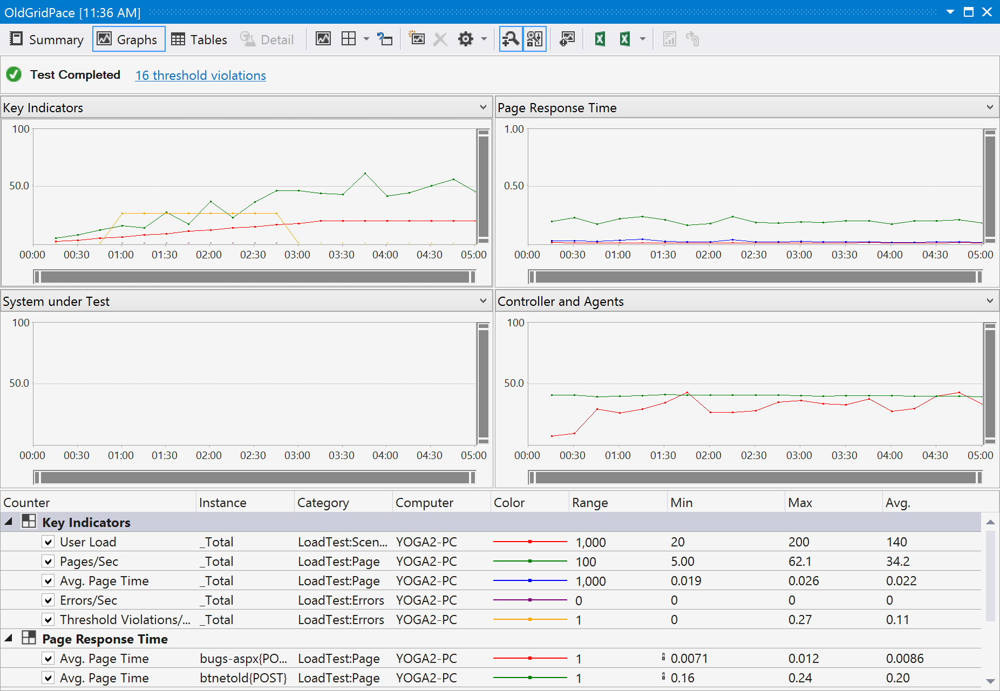

There is more information that we really need here. We are specifically interested in comparing the CPU usage, memory usage and request response time for grid actions for each run. Another important number to look at is the total number of of tests run. Given the options we selected, we should expect each load test to execute somewhere around 670 tests. This number will vary a little because some of the indvidual tests will be in-process when the 5 minute load test ends. Those in process tests will not be included in the number of tests. If the total number of tests starts to fall, this is an indication that BugTracker is not able to keep up with the simulated load of the load test.

Here is a summary of the results for the overall load test:

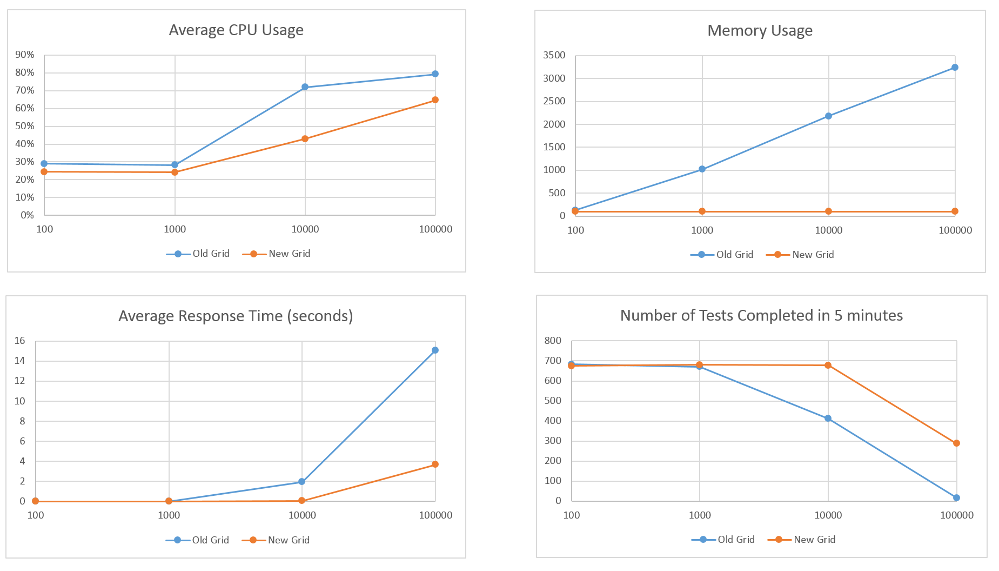

These results show that the new grid performs much better than the old grid in terms of response time, CPU usage and memory usage. The difference are more dramatic as the number of bugs in the database increases. This is largely due to the fact that the old grid stores the results of every bug query in session state. You can tell from the memory usage chart that the memory footprint of Bug Tracker with the old grid is a function of the number of active users and the number of bugs in the database. This is a stark contrast with the memory footprint of Bug Tracker with the new grid, which is a constant 100MB regardless of the number of active users or bugs in the database. What this means for the old grid is that both memory and CPU become a limiting factor in terms of how many active users the application can handle. We can see this by looking at the detailed results over the 5 minutes test run with 10,000 bugs.

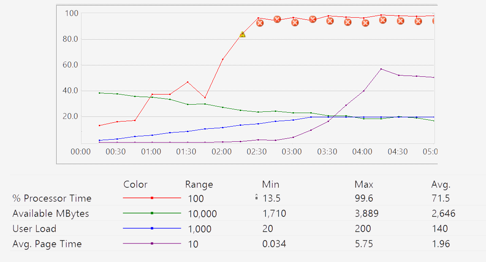

We can see that as the number of active users increases, the amount of available memory on the machine decreases due to the bugs being stored in session state. Eventually, the web server is using nearly 100% of the CPU retrieving and manipulating the data that is stored in memory. As a result, the average page request time starts to go up and the users start to see a significant delay when performing grid actions. On average, a grid action takes just under 2 seconds to process. During the 5 minute test, only 470 of the expect 670 tests are completed.

By comparison, the new grid performs well with 10,000 bugs in the database. The CPU usage does increase as the number of users increase, but the utilization never reaches a critical level. Memory usages is constant. Overall, the users likely do not notice a difference as grid actions are processed on average in 71ms. As a general rule of thumb, users will perceive any action that takes les than 100ms as instantaneous. Over the 5 minute test, all 670 tests are completed.

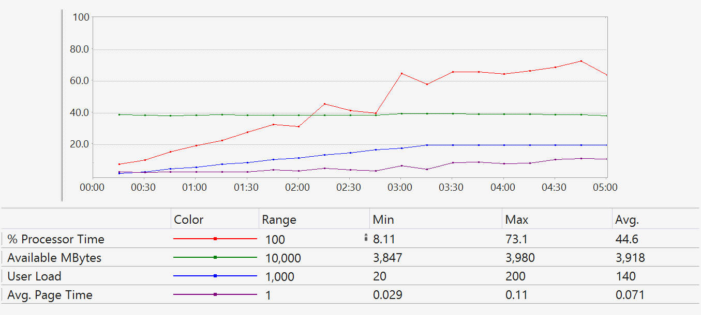

When testing with 100,000 bugs, the old grid is only able to complete 17 tests. The web server process is immediately using 100% of the CPU and all available memory is used. The average response time to process grid actions is over 15 seconds. In this scenario, the new grid also starts to reach a limit. Memory usage is constant, but CPU usages eventually starts to approach 100%. A total of 271 tests are completed with the average response time to process grid actions of 3.7 seconds. It is interesting to compare the CPU usage between the old grid and the new grid in the 100,000 bug scenario. With the old grid, the Web Server was using 100% of the CPU. In the new grid, the Web Server was using 50% while SQL Server was using the other 50%. This means that for the new grid, we could potentially increase throughput by moving the database server to a different machine. With the old grid, our only option is to get a faster server.

##Conclusion
Grid components provide a large amount of functionality in most line of business applications. Swapping out grid components can be time consuming and should be approached with caution. When done correctly, the results can be dramatic, offering improved functionality and potentially better performance.
