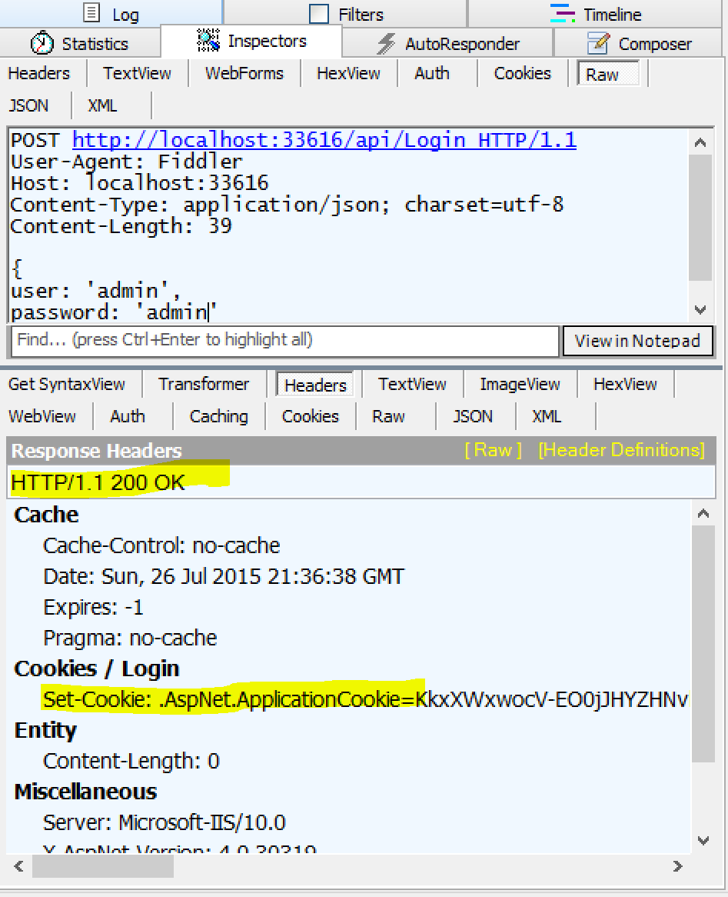

#Replacing the Mega Postback with Web Api
There is a pattern that can be found in a few places in BugTracker.NET. I'm not sure what to call it other than the mega postback. These are aspx pages that contain no view. The page consists entirely of code in the page load method, following this pattern:

```
    public partial class mega_postback : BasePage
    {

        public void Page_Load(Object sender, EventArgs e)
        {
            if (IsPostback)
            {
               //Business Logic handling the post request
            }
        }
   }
```
A great example of this in is the code-behind for the insert_bug.aspx page which I have abbreviated below. You can see the full version [here](https://github.com/dpaquette/BugTracker.NET/blob/fef3db538ed359fd60e1d6ce18976a5f75f61c16/src/BugTracker.Web/insert_bug.aspx.cs).
```
    public partial class insert_bug : BasePage
    {
        public void Page_Load(Object sender, EventArgs e)
        {
            Util.set_context(HttpContext.Current);
            Util.do_not_cache(Response);

            string username = Request["username"];
            string password = Request["password"];
            string projectid_string = Request["projectid"];
            string comment = Request["comment"];
            //...get and validate all the other parameters 

            // authenticate user
            bool authenticated = Authenticate.check_password(username, password);

            if (!authenticated)
            {
                Response.AddHeader("BTNET", "ERROR: invalid username or password");
                Response.Write("ERROR: invalid username or password");
                Response.End();
            }
            
            //..300 lines of code related to inserting a bug and sending notificaitons
            
            Response.AddHeader("BTNET", "OK:" + Convert.ToString(bugid));
            Response.Write("OK:" + Convert.ToString(bugid));
            Response.End();            
        }
    }

```

The aspx page itself is empty. All code paths for the Page_Load method above write either "OK" or "ERROR" to the response and call Response.End(). This page is called from the POP3 integration process that creates bugs from incoming email bug reports:
```
//...Create the URL and message body based on incoming email
HttpWebRequest req = (HttpWebRequest)WebRequest.Create(Url);
req.Credentials = CredentialCache.DefaultCredentials;
req.PreAuthenticate = true;
req.Method = "POST";
req.ContentType = "application/x-www-form-urlencoded";
req.ContentLength = bytes.Length;
Stream request_stream = req.GetRequestStream();
request_stream.Write(bytes, 0, bytes.Length);
request_stream.Close();
res = (HttpWebResponse)req.GetResponse();
//...Check the response for OK vs ERROR message
``` 
The logic around this is more complex than it needs to be. With Web API, we have a much easier approach to creating an HTTP api that will feel much more standard than the attempt to create an API using this mega-postback pattern.
##Adding a Web API controller
Luckily, we added Web API back when we updated the grid components so adding a new controller is easy. Right click the Controllers folder and select Add-> Controller. Select the Web Api Controller - Empty template and name the controller BugController.
We will add the `Authorize` attribute to the BugController to ensure that only aunthenticated users can acess the endpoints exposed by this controller. Adding this simple attribute will eliminate 30-40 lines of code from insert_bug.aspx. The authentication step will be handled separately by the caller as we will see later.
Next, we will add a placeholder for the Post method. This method will be accessed by the API client by sending a POST request to `api/BugFromEmail`.
```
[Authorize]
public class BugFromEmailController : ApiController
{
    [HttpPost]
    public IHttpActionResult Post()
    {
        return Ok();
    }
}
```
[View the commit](https://github.com/dpaquette/BugTracker.NET/commit/a33da4140a8a0c7e99a1212a116835141c3d2a40) - Add Bugs Controller

##Model Class and Validation
In the mega post-back, request parameters are accessed via the Request indexer.
```
string username = Request["username"];
string password = Request["password"];
string projectid_string = Request["projectid"];
string comment = Request["comment"];
string from_addr = Request["from"];
string cc = "";
string message = Request["message"];
string attachment_as_base64 = Request["attachment"];
string attachment_content_type = Request["attachment_content_type"];
string attachment_filename = Request["attachment_filename"];
string attachment_desc = Request["attachment_desc"];
string bugid_string = Request["bugid"];
string short_desc = Request["short_desc"];
```
When using Web API, we can create a class that contains all the parameters from the request. Since the client will already be logged in, we don't need the username and password to be part of the request. The user information can be access from the User property of the base ApiController.

The new BugFromEmail model class looks like this:
```
public class BugFromEmail
{
    public int? ProjectId { get; set; }
    public string Comment { get; set; }
    
    [Required]
    public string FromAddress { get; set; }
    public string CcAddress { get; set; }
    public string Message { get; set; }
    public byte[] Attachment { get; set; }
    public string AttachmentContentType { get; set; }
    public string AttachmentFileName { get; set; }
    public string AttachmentDescription { get; set; }
    public int? BugId { get; set; }
    public string ShortDescription { get; set; }        
}
``` 
Notice that the FromAddress is marked as Required using a data annotation attribute. This will allow us to use model state validation in the controller action. Strangely, the FromAddress is the only item that is required for the create bug request in BugTracker. All other properties fall back to defaults.
 
The controller Post method will accept an instance of the BugFromEmail class which will be mapped automatically by Web API from the body of the request. After checking if the model state is valid, it can continue with processing the request. If not, then a BadRequest (HTTP 400) result is returned. Note that we will rely on the standard HTTP response codes instead of a text based OK / ERROR result. As we will se later, using standard response codes will allow us to  us standard error handling available in HTTP client libraries.

```
[Authorize]
public class BugFromEmailController : ApiController
{
    [HttpPost]
    public IHttpActionResult Post([FromBody] BugFromEmail bugFromEmail)
    {
        if (ModelState.IsValid)
        {
            //Insert the bug
            return Ok();
        }
        else
        {
            return BadRequest(ModelState);
        }
        
    }
}
```
##Adding the logic
As a first pass, we can move the code from insert_bug.aspx to the Post method. Simply by moving to Web API, we can make eliminate some code that is handled for us by Web API. One example is the following code for logging in is no longer necessary.

```
if (username == null
|| username == "")
{
    Response.AddHeader("BTNET", "ERROR: username required");
    Response.Write("ERROR: username required");
    Response.End();
}

if (password == null
|| password == "")
{
    Response.AddHeader("BTNET", "ERROR: password required");
    Response.Write("ERROR: password required");
    Response.End();
}

// authenticate user

bool authenticated = Authenticate.check_password(username, password);

if (!authenticated)
{
    Response.AddHeader("BTNET", "ERROR: invalid username or password");
    Response.Write("ERROR: invalid username or password");
    Response.End();
}
IIdentity identity = Security.Security.GetIdentity(username);
```

The Authorize attribute already ensure that only authenticated clients will be able to call this method. If the client is not authenticated, Web API will return an appropriate response code. Since the client is authenticated, we can get the IIdentity instance the same way we do every where else in the application:

```
IIdentity identity = User.Identity;
``` 
Likewise, the following code for parsing request parameters is no longer needed since this is handled automatically by the Web API model binder:
```
string projectid_string = Request["projectid"];
int projectid = 0;
if (Util.is_int(projectid_string))
{
    projectid = Convert.ToInt32(projectid_string);
}
```
Finally, the responses are also simplified since we no longer need manually write the response text:
```
Response.AddHeader("BTNET", "OK:" + Convert.ToString(new_ids.bugid));
Response.Write("OK:" + Convert.ToString(new_ids.bugid));
Response.End();
```
Instead, we can use a standard 200 OK response in Web API:
```
return Ok(newIds.bugid);
```
The code for this web api method is still more complex than I would like it to be, but it is a big improvement from what we started with. We were able to eliminate ~90 lines from a 340 line method. Since the new code is a little easier to understand, we are also in a much better position to refactor it going forward.

[View the Commit - Simple move of Insert_bug.aspx to Web API](https://github.com/dpaquette/BugTracker.NET/commit/abf82b5edb46dc51be5278419a882e33569ec6fe)

##Supporting Client Login
We could attempt to post to the existing login page to login as a client but that would make for some confusing code. Instead, I extracted the login code to a class that can be used by the existing login page and by a new login Web API controller.

The controller itself is very simple:

```
public class LoginController : ApiController
{
    [HttpPost]
    public IHttpActionResult Post(LoginModel loginModel)
    {
        LoginResult loginResult = Authenticate.AttemptLogin(Request.GetOwinContext(), loginModel.User, loginModel.Password);

        if (loginResult.Success)
        {
            return Ok();
        }
        else
        {
            return StatusCode(HttpStatusCode.Forbidden);
        }
    }
}

public class LoginModel
{
    public string User { get; set; }

    public string Password { get; set; }
}
``` 

Testing this endpoint in Fidler shows the 200 OK result on successful login as well as the Set-Cookie header for the authentication cookie. It will be the client's responsibility to include this cookie in subsequent requests.



[View the commit - Refactored Login logic to support web api login](https://github.com/dpaquette/BugTracker.NET/commit/97e0ee6e71bb11c8ac8df9a0dd89290bebbc3fc2)

##Updating the Client
Next, the client will need to change a little. We changed the URL for posting bug from email and we also changed the way we authenticate. Instead of passing the username/password with the request, we will need to login as a separate request.

While we are making changes to the client here, we should also upgrade to a more modern library for making HTTP Requests. The current recommended library for making HTTP requests is Http Client.

```
Install-Package Microsoft.Net.Http
```

We can simplify the error logic a lot by using the EnsureSuccessStatusCode() method on the response object. This will throw an exception if the status code is anything other than a 200 OK.

```
using (var httpClient = new HttpClient(handler))
{
    var loginParameters = new Dictionary<string, string>
    {
       { "user", ServiceUsername },
       { "password", ServicePassword }
    };

    HttpContent loginContent = new FormUrlEncodedContent(loginParameters);
    var loginResponse = await httpClient.PostAsync(LoginUrl, loginContent);
    loginResponse.EnsureSuccessStatusCode();

    string rawMessage = Encoding.Default.GetString(mimeMessage.RawMessage);
    var postBugParameters = new Dictionary<string, string>
    {
       { "projectId", Convert.ToString(projectid) },
       { "fromAddress", from },
       { "shortDescription", subject},
       { "message", rawMessage}
       //Any other paramters go here
    };
    if (useBugId)
    {
        postBugParameters.Add("bugId", bugidString);
    }

    HttpContent bugContent = new FormUrlEncodedContent(postBugParameters);
    var postBugResponse = await httpClient.PostAsync(InsertBugUrl, bugContent);

    postBugResponse.EnsureSuccessStatusCode();
}
if (MessageInputFile == "" && DeleteMessagesOnServer == "1")
{
    write_line("sending POP3 command DELE");
    client.DeleteMessage(message_number);
}
}
catch (Exception e)
{
    write_line("HttpWebRequest error url=" + InsertBugUrl);
    write_line(e);
    write_line("Incrementing total error count");
    total_error_count++;
}

```

[View the commit - Update btnetservice to use HttpClient and new Web API endpoints](https://github.com/dpaquette/BugTracker.NET/commit/f77366f74e4b34892a963a9e6b6313fe6ae0f242)

##Conclusion
We have shown how moving from a _mega post back_ to a more standard Web API can help to simplify our code. While more refactoring can be done to improve the implementation further, we have achieved our goal of replacing the _mega post back_ with an implementation that is easier to understand and much easier to test.
