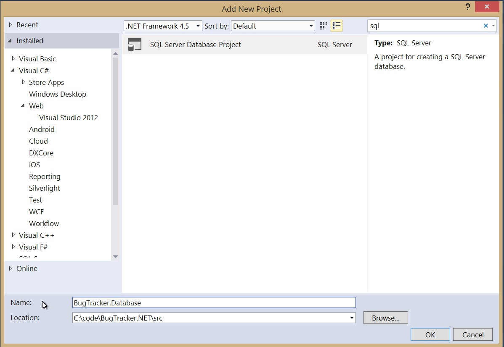
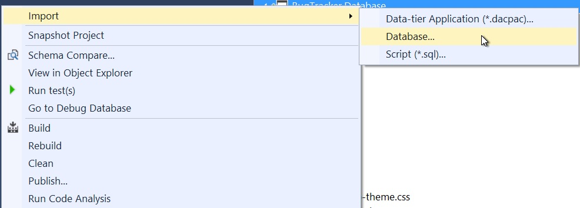
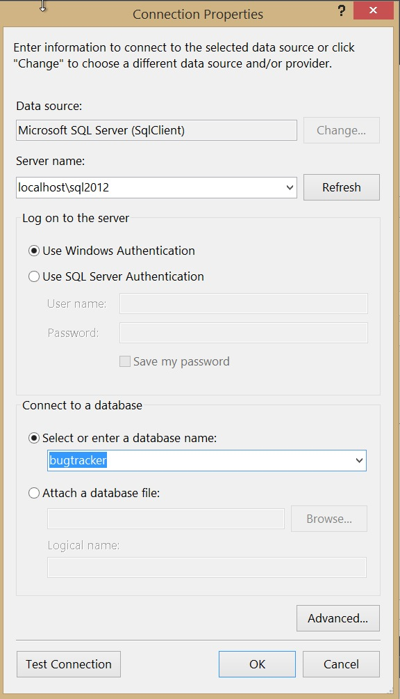
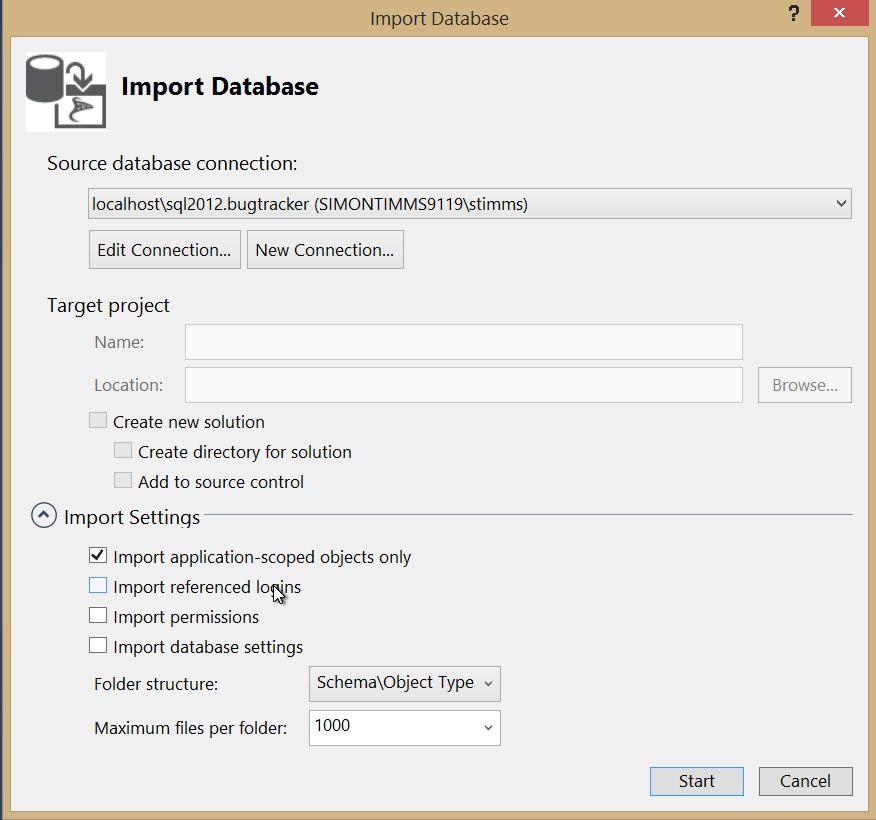
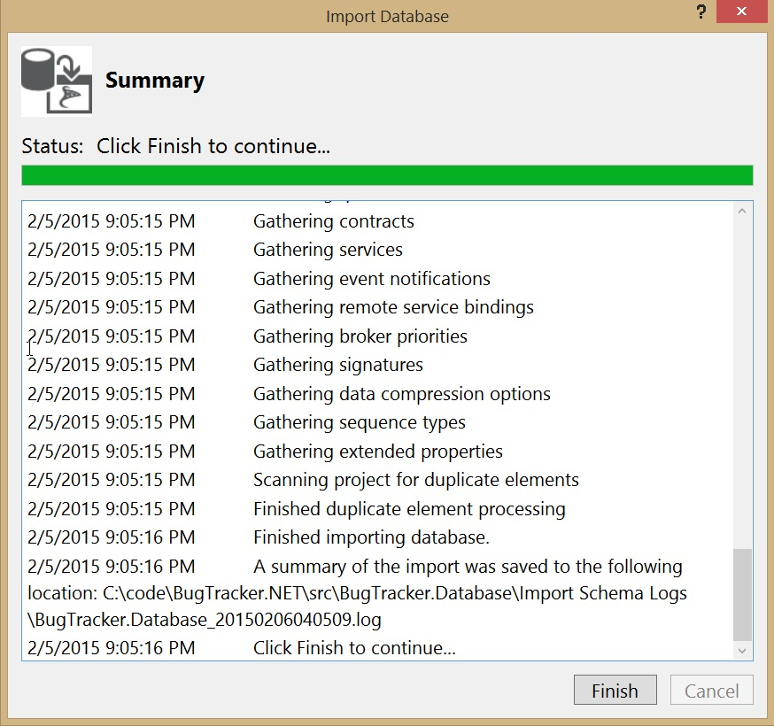
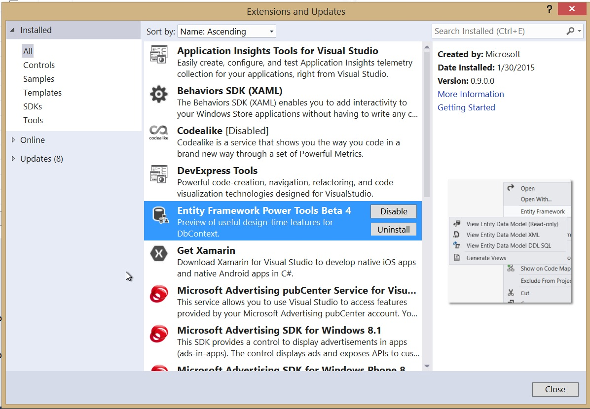

Database access is one of those things that is continually changing in the .net world. When I started doing .net development datatables and ADO.net were all the rage. Typically these were accessed over web services just to throw some unnecessary network latency into the mix. It was not at all uncommon to see a web application that called a web service, often on the same machine, that would access a database, extract a datatable and then serialize that and send it back over the network. In hindsight it was a terrible architecture but we didn't think that at the time. In a few years everything we believe is best practice now will also be considered wrong.

A> In the world of accounting the normal way to maintain a list of debits and credits is through a system known as "double entry bookkeeping". This system was developed in Italy some time [before the year 1400](https://en.wikipedia.org/wiki/Double-entry_bookkeeping_system#History). It remains more or less unchanged to this day. Whenever you're upset at the pace that things change in computer technology imagine how boring it must be to work in a field where all the major chalenges were solved 600 years ago.

I've used numerous other data access tools over the years

 - LINQ2SQL
 - SubSonic
 - Dapper
 - Entity Framework
 - NHibernate

to name just those I remember off the top of my head. All of these tools attempt to bridge the gap between the relational world of SQL databases and the object world in which we program.

If we take a look at BugTracker.net we can see that it predates any of these nifty object relational mapping technologies. It is still heavily dependant on using loosely typed collections such as DataSet to hold information from the database. There is a lot of overhead to these collections and we lose out on all the advantage of using a strongly typed language. Type conversion errors are not caught until run time.

Dynamic typing is fine if you have a good collection of unit tests to cover the implicit tests that the compiler performs. Unfortunatly BugTracker.NET is devoid of tests. This is a deficiency we're going to address at some point but first things first we should look at leveraging an object relational mapper to help out.

A> Many programmers are moving away from using object relational mappers(ORMs). The reasoning is that there is a discord between objects and relationships. This is, in effect, the law of leaky abstractions: as you add layers to cover complex actions with simple ones there are some nuances about the lower layers that are lost.

A> For instance the n+1 problem is not one that occurs outside of an object relational mapper. In order to address the shortcomings with object relational mappers some suggest completely abandoning them as being more trouble that they are worth. I think that ORMs are a great 80% solution. You cannot do everything with an ORM but the vast majority of tasks more easily and more reliably. For the places where some specialized functionality is needed (bulk operations, high performance,...) then you can drop to using lower level tools or tools that are specifically built for that scenario.

A> A very fair, if dated, treatment of the whole Object/Relationship mismatch is available on Ted Neward's blog entitled [The Vietnam of Computer Science]( http://blogs.tedneward.com/2006/06/26/The+Vietnam+Of+Computer+Science.aspx).

For future development on BugTracker.NET we would like to find an ORM based solution for accessing the database in net new code. Before we get to that point, however, we would like to address one of the pain points for BugTracker.NET: when we make changes to the database.

In the security chapter we updated the table structure of the database to account for the longer passwords and salts the new password hashing algorithms needed. To do this we opened up a rather sizeable file called upgrade.sql and appended

```
alter table users add password_reset_key nvarchar(200);
alter table users alter column us_salt nvarchar(200);
alter table users alter column us_password nvarchar(200);
```

We also updated the creation script to have these same changes. Manually updating the database structure like this is error prone and, as you can tell from the length of the file, time consuming. Because there is both an update.sql file and a full creation script the changes need to be made in two places, introducing another vector for errors. If you don't know the current version of your database then you don't know which part of the file to start at to bring your database up to date. It would be nice to have some tooling take care of this for us.

There are two very good options for versioning database structure:

1. SQL Server Project
2. Entity Framework Migrations

SQL Server Projects are special Visual Studio projects that break the current database structure into text files for tables, views, stored procedures and any other database object. During deployment the deployment tool will diff the structure of the database as described in the text files against the structure of an existing database and generate an upgrade script.

I'm a fan of SQL projects as they provide the ability to generate custom upgrade scripts while maintaining full control over the database. If developers are used to working with SQL this is a fantastic path to upgrade the way in which database updates are deployed. There is no need to abandon existing knowledge and move to another method of update databases.

However SQL projects require that all your developers use Visual Studio; a scenario that is becoming less common.

There are quite a few options available at the moment in the .net space for ORMs. With the release of newer versions of Microsoft's Entity Framework has really picked up its game to the point where it is as good as or better than any other ORM.

One of the features of EF is migrations. When building a model in EF migrations between one model state and another can be written in pure C#. These migrations are very useful when using a code first approach to Entity Framework. The next release of Entity Framework drops support for model and db first and only supports code first. So it is likely that migrations will become more common.

Each of these approaches has its advantages and disadvantages. For existing projects that may have made use of stored procedures or other artifacts of SQL Server an SQL Project is the better option.

This gives us our strategy for update the data access for the application: first we will extract an SQL project from an existing database instance built from the creation script. Second we'll generate a series of model classes and a datacontext allowing our database to be used from Entity Framework. Finally we'll pick a page in the application to update to use Entity Framework just as a demonstration.

##Generating an SQL Project

SQL projects are a fantastic tool for cleaning up existing databases as well as working with new databases. They are an evolution of the older database projects that were all the rage some years ago. We'll start by adding a new SQL project to the solution.



Here we've called the project BugTracker.Database.  Once we have the database right clicking on it we are presented with the option to import an existing database.



Within that we can select our existing database that was built from the original SQL script. In my case this is the bugtracker database on localhost\sql2012.



With that familiar dialog behind us we can alter some setting on the import database window. It is likely that you'll want to disable the import of referenced logins as they will be different from test to production.



The tool will run for a while and generate a bunch of new files.



The result is a couple of directories containing a file for each database object: table, stored proc, view, etc.

[View the commit](https://github.com/dpaquette/BugTracker.NET/commit/b9088e46cd9e7951f80198e75454bb98df00b9db)

The SQL project brings with it the ability to deploy directly and to generate .dacpac files as part of a build. These .dacpac files are basically portable versions of the schema which can be compared with existing databases to generate diffs. It can even generate a full database if targeted at a blank database. This eliminates the need to know what version an existing database is to upgrade it.

##Generating EF Classes

Now that we have a reliable way to manage database scripts and to upgrade databases we can turn our attention to accessing the database.

There are a bunch of ways to use Entity Framework

- Model first
- Database first
- Code first

The model and database first approaches are being deprecated in future versions so let's take the code first approach. In the past I've built model classes by hand. This process is a bit slow and somewhat error prone, especially around the precision of decimals. David suggested that I try using the model generator tool to build models by looking at the database.

In Visual Studio install the Entity Framework Power Tools.



This brings us a new menu option: to reverse engineer a data model. Unfortunatly this sounds far cooler than it is and, unlike the movie Paycheck, Aaron Eckhart is unlikley to try to kill you for doing it.


Running the tool on our web project will install the Entity Framework package from nuget and then build three different object types:

- A data context
- Model classes for each table
- Mapping companion classes for each model class

[View the commit](https://github.com/dpaquette/BugTracker.NET/commit/ddd3dfec3e049a1a387878905b1aacfea2d02158)

With these in place we're now able to make use of EF to access the database. However the classes that are generated are named as they are in the database which is not ideal for use in code. For instance the ```bug_tasks``` table has been mapped to a class called ```bug_tasks```. This is not, typically, how we would name classes in C#. Instead we would call this class ```BugTasks```.

We're going to have to get into some code clean up to rename all of these something sensible. 

##Cleaning up EF Classes

##Migrating to EF
