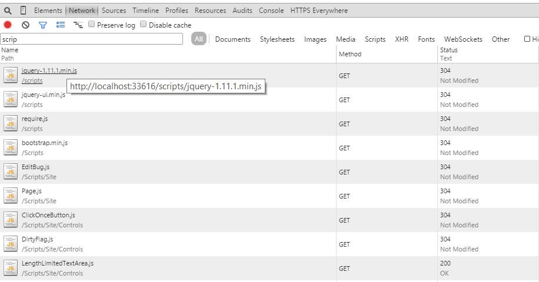
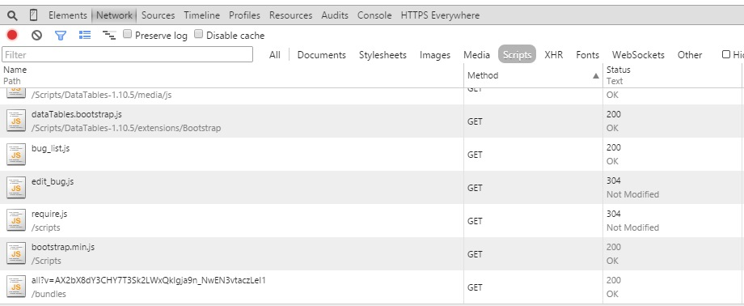

# JavaScript

The growing importance of JavaScript as a language cannot be ignored. It is possible and even common to see large applications written in JavaScript. JavaScript is not a new language and it is certainly one that has evolved over the years. During this evolution we have added much more rigor to it largely by inventing methods of abusing the language. JSON format was not so much formally specified in the language so much as discovered by Douglas Crockford. Equally classes and modules were not originally envisioned as part of the language. Developers have invented a rather arcane way to organize code into classes and modules using existing JavaScript syntax.

The recently released ECMAScript 6 standard adds a formal definition of classes to JavaScript along with a number of other very useful features such as generators. Code understandability has been greatly increased through the introduction of the ```let``` scoping as ```const``` which prevents variables from being changed after initialization. Testability of the code has moved from a rare activity done only by running the code in a full browser to one integrated with command line runners that have no DOM. We are no longer in an age where it is acceptable to simply slap a few lines of JavaScript into an existing HTML page and call it done.

At least we hope that we're no longer in that era. BugTracker.net is again a product of the times. The JavaScript is minimal and completely embedded into individual pages. There is no sharing of code between pages through the use of external JavaScript files. In fact the most common piece of JavaScript in the application: a chunk used to submit the current form

```
<script>
function submit_form() {
    var frm = document.getElementById("<%:Form.ClientID%>");
    frm.submit();
    return true;
}
</script>
```

exists in near identical form on 14 pages. Even code which we have previously extracted such as the sortable behaviour are not necessarily included in the way we would like them to be. 

We're going to look at two parts of our JavaScript approach. The first part is how we organize the JavaScript files on disk and into namespaces. The second half is how we assemble and process the JavaScript files for inclusion in the project. 

## Laying out the JavaScript

As we add more and more JavaScript to a project keeping it organized becomes difficult, or at least we must pay more attention to it. Mixing JavaScript into HTML is not a scalable approach - it is near impossible to test and we cannot easily reuse functionality between different pages. Including the functionality in the markup is also mixing style with functionality which does not properly observe separation of concerns. A change to the layout of a page should not run the risk of changing the functionality. Even though HTML isn't an object it is still desirable to observe the [single responsibility principle](http://blog.8thlight.com/uncle-bob/2014/05/08/SingleReponsibilityPrinciple.html). Finally having a long file with a bunch of script in it encourages long methods and ignoring modularity.

My approach to laying out JavaScript is to mirror the layout of the HTML files as much as possible. On an ASP.net MVC project I keep a directory called Scripts at the same level as the Views directory. If I have a view in the ```Home``` directory called ```Index``` then the JavaScript for that page will live in a directory called Pages/Home. 


Common code will also live in this directory structure under another folder at the same level as Pages. Code related to controls such as the code needed to create datetime pickers will live in a Controls folder. Boiler plate utility code may live in a Util folder (some might argue that having a Util folder is giving us permission to shove any old thing in there but so long as you approach it with the same rigour as the rest of the JavaScript code you should be fine). Finally I have a folder called something like BusinessLogic or Domain that holds any business logic which happens to be in JavaScript. I always have trouble deciding on a name for this folder and have been through a good dozen on various projects. The name is less important than the fact that you have this cross-cutting code split out from JavaScript code that may be concerned with setting up user controls - they aren't anything like the same thing.

We are mixing into BugTracker.NET some small components written in ASP.net MVC however the majority of the code remains written against WebForms. We can take the same approach with establishing a JavaScript file per .aspx file for page specific code and another directory for controls. The ultimate goal here is to create a number of small JavaScript files instead of large, monolithic files. 

###Form Submission

As was pointed out earlier one of the most egregious uses of JavaScript in the application is the submission of various forms. To address this let's start by creating a JavaScript file to contain this functionality. Because it is used so commonly I'm comfortable putting it into a base class called Page that will be used on every page of the site. It is going to look like 

```
var BugTracker;
(function (BugTracker) {
    var Page = (function () {
        function Page() {
            $("[data-action=submit]").on("click", function (event) {
                event.target.closest("form").submit();
            });
        }
        return Page;
    })();
    BugTracker.Page = Page;
})(BugTracker || (BugTracker = {}));

var page = new BugTracker.Page();
```

This file gives some pretty good hints about how we'll be dealing with scripts on the site. First off you'll note that we're creating an object called BugTracker.  This is going to be the base object into which we will put all the other objects. JavaScript doesn't have a first class module system in the way that Java or C# does and so this is the way it is done. Into that object we put a Page object that will be responsible for holding common methods that are applicable to most or every page. At the moment we have only the single form submission action that fits that bill. You may also notice that we've changed the way that the action is attached. We're using jQuery to attach a click handler to any element that contains a data-action attribute. Data attributes were introduced as part of HTML5 to hold private data. I use them to provide a way to attach actions to elements. A lot of people would use a class for this but in my mind classes should be used only for styling information.

Finally we create a new instance of the Page class. This will run the constructor that will assign the click action to any element that has the data attribute. We now need to make sure that the pages that need to have JavaScript form submission have the data attribute. For example the DeleteStatus.aspx page now contains no specific JavaScript but it does contain

```
<a id="confirm_href" runat="server" data-action="submit"></a>
```

We now need to apply that change to the entire site.

[View the commit - Replacing all calls to submit form with standard page script](https://github.com/dpaquette/BugTracker.NET/commit/fb59fa3723ccea340214a0b43cd550c11cf2caa3)

Working through each one of the pages on the site and moving the JavaScript out is a major undertaking. However we can chip away at it as we work on pages for other reasons. We won't do a wholesale replacement but let's look at a slightly more complex example so we can feel confident in our methods. 

Perhaps the most complex JavaScript on the entire site appears, unsurprisingly, on edit_bug.aspx. Not only is there a fairly large block of text on the page itself but there is also a rare standalone JavaScript file, edit_bug.js which clocks in at over 500 lines. What makes the page even more interesting is that there are ASP.net variables injected into the script:

```
<script>
    var this_bugid = <%=Convert.ToString(id)%>;

    $(document).ready(do_doc_ready);

    function do_doc_ready() {
        date_format = '<%=btnet.Util.get_setting("DatepickerDateFormat", "yy-mm-dd")%>';
        $(".date").datepicker({ dateFormat: date_format, duration: 'fast' });
        $(".date").change(mark_dirty);
        $(".warn").click(warn_if_dirty);
        <% if (User.Identity.GetUseFCKEditor())
           {
               Response.Write("CKEDITOR.replace( 'comment' )");
           }
        %>
        on_body_load();
        $(document).on("unload", "body", function () { on_body_unload(); });
    }
</script>
```

If we move all the script outside of the page then we'll lose the ability to inject variables [^injectjs]. Our task list for cleaning up this JavaScript looks like: 

1. Find a way to eliminate the use of ASP.net tags inside our JavaScript
2. Move the functionality from the script on the page to a standalone JavaScript file
3. Namepsace the existing JavaScript
4. Break up the rather large JavaScript file into several files

###Removing ASP.net Tags

The first item that is injected through ASP.net tags is the bug Id. Let's move that to a data attribute on the container holding all the controls. This is a logical place for everything inside the container is specific to that bug Id. 

```
<div class="container" data-bug-id="<%=Convert.ToString(id)%>">
```

This can now be accessed from within the script by using:

```
var this_bugid = parseInt($("[data-bug-id]").attr("data-bug-id"));
```

The next issue is the date format which is taken from a setting. I used the same approach for it. I don't love doing that because it isn't really a setting that is specific to this page. However we must be pragmatic about our approach - I don't want to have to introduce an entire configuration system for JavaScript at this point. The final field we'll move to a data declaration is the FCK Editor flag. The final declaration looks like:

```
<div class="container"
	 data-bug-id="<%: Convert.ToString(id)%>"
	 data-date-format="<%: btnet.Util.get_setting("DatepickerDateFormat", "yy-mm-dd")%>"
	 <%: User.Identity.GetUseFCKEditor() ? "data-use-fck-editor=''" : "" %> >
```

The inline JavaScript no longer makes use of any ASP.net markup and looks like 

```
<script>
    var this_bugid = parseInt($("[data-bug-id]").attr("data-bug-id"));

    $(document).ready(do_doc_ready);

    function do_doc_ready() {
        date_format = $("[data-date-format]").attr("data-date-format");
        $(".date").datepicker({ dateFormat: date_format, duration: 'fast' });
        $(".date").change(mark_dirty);
        $(".warn").click(warn_if_dirty);
        if ($("[data-use-fck-editor]").length > 0) {
            CKEDITOR.replace('comment');
        }
        on_body_load();
        $(document).on("unload", "body", function () { on_body_unload(); });

    }
</script>
```

[View the commit - Moving declaration of ASP.net calls out of JavaScript](https://github.com/dpaquette/BugTracker.NET/commit/48669d93036c29741c06c4dc60ebe1386ffe2c8e)

###Moving Functionality to JavaScript File

We've already discussed why it isn't a good idea to keep JavaScript in the same file as HTML so our next step is to relocate the JavaScript from edit_bug.aspx to the already existing edit_bug.js. As it turns out this is quite a simple operation due to the fact that the contents of edit_bug.js consists entirely of functions. There is no real ordering requirement except that we put the page script after the rest of the script in the file.

[View the commit - Relocating JavaScript from edit_bug.aspx to edit_bug.js](https://github.com/dpaquette/BugTracker.NET/commit/fb3946d7585df7d2a2f9be164f6967eab80b3e3c)


A brief run through the functions on the page seem to indicate that everything is working as expected. It also suggest that there are a number of functions that aren't used - perhaps they were old functions or perhaps we've removed them without updating the JavaScript as part of the redesign. We can do simple string searches through the project to find functions that are not used.

As it turns out there is only a single function that is not used so we'll pull that out. 

[View the commit - Removing unused code](https://github.com/dpaquette/BugTracker.NET/commit/3438f0c8bf969fbc5884953e4230e377f715c118)

There is also a swath of code that appears to deal with changing the style of some drop downs. We handle all this in CSS since the redesign so we can removed that. 

###Namespacing the JavaScript

At the most rudimentary level namespacing the JavaScript requires moving it into a closure 

```
var BugTracker;
(function (BugTracker) {
	var EditBug = (function () {
	//add functions here
	};
	return EditBug;
    })();
    BugTracker.EditBug = EditBug;
})(BugTracker || (BugTracker = {}));
```

In so doing we need to put in references to the current object any time we reference a variable or function in the current object. 

[View the commit - Adding namespaced JavaScript for edit_bug.js](https://github.com/dpaquette/BugTracker.NET/commit/f6eab7319fff5f2d07953426b3b43873ab345958)

You'll notice that we've hoisted the variable definitions to the constructor of the new class which is already a big improvement on the construction of the old file.

```
function EditBug() {
            this.popup_window = null;
            this.dirty = false;
            this.cls = null;
            this.ie = null;
            this.ren = new RegExp("\\n", "g");
            this.ren2 = new RegExp("\\n\\n", "g");
            this.color = 128;
            this.timer = null;
            this.new_posts = null;
            this.hex_chars = "0123456789ABCDEF";
            this.bugId = parseInt($("[data-bug-id]").attr("data-bug-id"));
        }
```

We can now replace the initialization on the page with

```
$(document).ready(function () {
    var page = new BugTracker.EditBug();
    page.on_body_load();
});
```

This will create a new instance of EditBug and call the body load function upon it. Any calls on the page such as those attached to the various buttons will need to be changed to reference the ```page``` object. At the moment the calls are hard coded not just in the HTML but in the code behind. 

```
if (permission_level != PermissionLevel.ReadOnly)
{
    string send_email_link = "<a class='btn btn-default' href='javascript:send_email("
        + Convert.ToString(id)
        + ")' title='Send an email about this item'><i class='glyphicon glyphicon-envelope'></i>&nbsp;Send Email</a>";
    send_email.InnerHtml = send_email_link;
}
else
{
    send_email.Visible = false;
}
```

We'll start by shifting the link construction to the .aspx file. Links, and especially styling such as the glyphion class should not be in the C# code. The C# code can become 

```
if (User.IsInRole(BtnetRoles.Guest) || permission_level == PermissionLevel.ReadOnly)
{
    send_email.Visible = false;
}
```

Which imediatly looks much cleaner. The .aspx file now contains

```
<li class="dropdown-toggle" id="send_email" data-action="send-email" runat="server">
    <a class='btn btn-default' title='Send an email about this item'>
        <i class='glyphicon glyphicon-envelope'></i>&nbsp;Send Email
    </a>
 </li>
```

You may notice that we've ripped out the call to send_email. This is because we'd like to keep our relationship between the elements on the page and the JavaScript actions in the JavaScript file. Instead we've put in a data-action attribute as we introduced earlier. In the constructor of EditBug we can tie the send_email funciton to this element.

```
 $("[data-action=send-email]").on("click", function () {
                return _this.send_email(_this.bugId);
 });
```

Notice that we take the bugId from the class level variable which, in turn, is taken from the attribute on the page. We must now repeat this for each of the links that has JavaScript actions hard coded in the C#.

[View the commit -  Moving javascript action bindings into pure JavaScript](https://github.com/dpaquette/BugTracker.NET/commit/e43494b4599b41290f65e43c325e7f8e7e6810cd)


Within the namespaced file you may notice that functions themselves are hung off the prototype of the class. This will save memory as the functions will not be recreated for each instance. An example looks like

```
EditBug.prototype.getElementsByName_for_ie6_and_ie7 = function (tag, name) {
            var elem = document.getElementsByTagName(tag);
            var arr = new Array();
            for (var i = 0, iarr = 0; i < elem.length; i++) {
                var att = elem[i].getAttribute("name");
                if (att == name) {
                    arr[iarr] = elem[i];
                    iarr++;
                }
            }
            return arr;
        };
```

I chose this particular function because what it does is find an element by using its tag and its name attribute. This is interesting because this sort of element selecting is something that jQuery is very good at. We mentioned before that we're going to drop support for older browsers. This function is also only used in one place to find a particular table cell.

```
this.new_posts = this.getElementsByName_for_ie6_and_ie7("td", "new_post");
```

In the spirit of always looking for easy ways to improve code as we're working with it we can replace this function call with 

```
this.new_posts = $("td[name=new_post]")[0];
```

If you want to get extra fancy you don't even need to use jQuery and can replace the call with 

```
this.new_posts = document.querySelector('td[name=new_post]')
```

which makes use of the selector API. jQuery will defer to this behavior if it is available and not buggy in the browser.

###Breaking up JavaScript

EditBug.js is over 400 lines long. While I don't have a particular limit in mind before a class becomes unmaintainable the nature of the code in this file gives me pause. The function are small but they are also largely unrelated. The vast majority of the functions don't call into other function which makes me think that the internal coupling in the class is low and so the class is not cohesive. Cohesion is important as it makes replacing the functionality in the future much easier. We can be confident that changes to a class that does nothing but handle e-mail address verification is not likely to change how web URLs are routed. 

Digging into the class we find that there are a few different responsibilities in the class

1. Warn when leaving the page if there are unsaved changes
1. Getting and setting cookies
1. Control the various buttons on the side of the page such as "Send E-mail"
1. Setting and restoring presets
1. Preventing the submit button being pushed twice
1. Restyling drop downs 
1. Counting the number of characters in some fields to show the number remaining
1. Deal with tags
1. Add jQuery UI calendar to date fields

Goodness, that's quite a lot of stuff for one little file to do! Let's start breaking it out. Our goal is to end up with some reusable components that can be applied to different places in the application. 

Marking the page as dirty is quite pervasive in the file. There are 10 places in the file that make some reference to the dirty state. Setting the dirty flag is done when a drop down changes or when a text area changes. Let's extract all of this dirty stuff and make a new file. 

```
var BugTracker;
(function (BugTracker) {
    (function (Controls) {
        var DirtyFlag = (function () {
            function DirtyFlag(container) {
                var _this = this;
                this.container = container;
                this.isDirty = false;
                container.on("change", "input", function () {
                    return _this.markDirty();
                });
                container.on("change", "select", function () {
                    return _this.markDirty();
                });
                container.on("change", "textarea", function () {
                    return _this.markDirty();
                });
            }
            DirtyFlag.prototype.markDirty = function () {
                this.isDirty = true;
            };
            return DirtyFlag;
        })();
        Controls.DirtyFlag = DirtyFlag;
    })(BugTracker.Controls || (BugTracker.Controls = {}));
    var Controls = BugTracker.Controls;
})(BugTracker || (BugTracker = {}));
```
This DirtyFlag control takes a form and catches any changes to select, input and textarea elements in it. We can use it on our page like so:

```
this.dirtyFlag = new BugTracker.Controls.DirtyFlag($("form[name=aspnetForm]"));
```

This call can be placed in the EditBug.js file. 

We can now take out the JavaScript calls to make_dirty such as

```
<textarea id="comment" rows="10" cols="100" runat="server" class="form-control" onkeydown="mark_dirty()" onkeyup="mark_dirty()"></textarea>
```

which becomes 

```
<textarea id="comment" rows="10" cols="100" runat="server" class="form-control"></textarea>
```

Next we can alter the warn_if_drity function to observe the new isDirty property in the DirtyFlag control. 

```
warn_if_dirty(event) {
            if (this.dirtyFlag.isDirty) {
                var result = this.my_confirm();
                if (!result) {
                    event.preventDefault();
                }
            }
        }
```
Finally we want to hook up the warn_if_dirty to any items on the page with the ```warn``` class. 

```
$(".warn").click(function (event) {
                return _this.warn_if_dirty(event);
            });
```

Much of the logic related to dirty flags has now be moved out of the EditBug.js file and into a control that can be reused whenever we wish.


[View the commit - Adding dirty flag](https://github.com/dpaquette/BugTracker.NET/commit/b875ab9392f22ebd5405b82009d78085ec504844)

Getting and setting cookies is a very common function in a web application. It makes very little sense to me that the functions to to this should exist in the page level JavaScript. This sort of functionality can be moved to a common location. A lot of people dislike having a Util or Utility namespace. It does tend to become a bit of a dumping ground for random scripts that have no other home. As long as you're cognizant of this and are vigilant in preventing Util from becoming too crowded I have no issue with it.

The code can be moved almost wholesale into a new class as a "static" method. I put static in quotes because JavaScript has no first class concept of static. 

[View the commit - Extracting cookie functionality](https://github.com/dpaquette/BugTracker.NET/commit/60e039293fe08c85b4178d1021f058be54aae2be)

Preventing the submit button from being hit more than once is a pretty common sort of issue. Let's see if we can extract that functionality out into another class. We need to disable the button that was just pushed. The original code disables any submit buttons on the page. It seems highly unlikely that the page would take so long to load as to allow users to find the other submit button and click on it. Typically we just want to avoid an accidental double click. Let's stick to that behaviour as it allows us to easily encapsulate the functionality.

The ClickOnceButton looks like this

```
var BugTracker;
(function (BugTracker) {
    (function (Controls) {
        var ClickOnceButton = (function () {
            function ClickOnceButton(selector) {
                var _this = this;
                $(selector).on("click", function (event) {
                    return _this.disableButton(event);
                });
            }
            ClickOnceButton.prototype.disableButton = function (event) {
                $(event.target).attr("disabled", true);
                $(event.target).val("Updating...");
            };
            return ClickOnceButton;
        })();
        Controls.ClickOnceButton = ClickOnceButton;
    })(BugTracker.Controls || (BugTracker.Controls = {}));
    var Controls = BugTracker.Controls;
})(BugTracker || (BugTracker = {}));
```

It looks long and confusing but that's really just the JavaScript module and class syntax which will be significantly improved in ES6. The only important parts are 

```
function ClickOnceButton(selector) {
    var _this = this;
    $(selector).on("click", function (event) {
        return _this.disableButton(event);
    });
}
ClickOnceButton.prototype.disableButton = function (event) {
    $(event.target).attr("disabled", true);
    $(event.target).val("Updating...");
};
```

The first function is the constructor and hooks up the click action. The second function is the click action which is fired when a user clicks on a button. The button is disabled and the text on it is updated. This can be attached by simply calling it in the constructor of EditBug.js

```
new BugTracker.Controls.ClickOnceButton("input[type=submit]");
```

We have a great, reusable component which can be used anywhere on the site. 

[View the commit - Extracting click once button](https://github.com/dpaquette/BugTracker.NET/commit/91885c1c689c1e5331508ae51568acbe7aca2ae0)

A similar approach can be applied to extract the various other pieces of functionality from the overly large EditBugs files. A final example is the text area that shows a remaining count.  This can quickly be extracted into a new control called LengthLimitedTextArea which looks like 

```
var BugTracker;
(function (BugTracker) {
    (function (Controls) {
        var LengthLimitedTextArea = (function () {
            function LengthLimitedTextArea(textAreaId) {
                var _this = this;
                this.textAreaId = textAreaId;
                $("#" + textAreaId).on("keyup", function () {
                    return _this.count_chars(textAreaId, 200);
                });
            }
            LengthLimitedTextArea.prototype.count_chars = function (textarea_id, max) {
                var textarea = $("#" + textarea_id);
                var count_span = $("#" + textarea_id + "_cnt");

                // \n counts as two chars by the time we insert,
                // so double them here for the purpose of counting
                var ren = new RegExp("\\n", "g");

                var s = textarea.val().replace(ren, "\n\n");
                var len = s.length;

                if (s.length > max) {
                    // truncate
                    var s = s.substr(0, max);

                    // convert the \n\n back to \n
                    var ren2 = new RegExp("\\n\\n", "g");
                    textarea.val(s.replace(ren2, "\n"));

                    count_span.text("0 more characters allowed");
                } else {
                    count_span.text((max - len) + " more characters allowed");
                }

                return true;
            };
            return LengthLimitedTextArea;
        })();
        Controls.LengthLimitedTextArea = LengthLimitedTextArea;
    })(BugTracker.Controls || (BugTracker.Controls = {}));
    var Controls = BugTracker.Controls;
})(BugTracker || (BugTracker = {}));
```

These are the same functions as before with some jQuery tweaking. It can be wired up in our EditBug.js by simply newing it up in the constructor. 

```
new BugTracker.Controls.LengthLimitedTextArea("short_desc");
```

There are some other controls that could be extracted from this file. In classic text book style we'll leave these as an exercise for the reader. 

##Processing JavaScript

There is a lot of advice out there about how to best set up JavaScript for your project. The approach we're going to take here is but one of many possible approaches. It is in line with the best practices suggested by Microsoft during the ASP.net 4 era. This is different from the approach that is suggested for ASP.net 5.  The fact that Microsoft have taken a totally different approach should not be taken as a sign that the 4 era approach was in any way wrong. The ASP.net 5 approach is simply more in line with the way that the large development community is treating JavaScript. Perhaps even that is unfair as the Ruby on Rails approach is similar to the ASP.net approach. The Django approach is different again, including individual files on each page as an asset. The ASP.net 5 approach is taken from the nodejs/io.js world. 

In ASP.net 4 the recommended approach is to use the excellent tools in the System.Web.Optimization namespace to bundle and minify JavaScript files. As JavaScript is executed on the client side there are all sorts of interesting network dynamics which come into play around transferring data to the client. The HTTP protocol by which the assets on a web page are transferred from the server to the client, is built on top of TCP/IP and is a stateless text protocol. Each asset transferred from the server requires a separate connection be opened by the client to the server[^http2]. The nice thing about using the bundling is that it is only active when running in production mode. During debug the individual files are served which makes debugging them easy. 

The first step is to install the optimizations tools

    Install-Package Microsoft.AspNet.Web.Optimization

Next we will generate a new file in the App_Start directory called BundleConfig. The contents of that file should describe how to build the bundles. In our case we'll start with a single bundle to hold all of the site specific JavaScript. 

```
public class BundleConfig
{
    public static void RegisterBundles(BundleCollection bundles)
    {
        bundles.Add(new ScriptBundle("~/bundles/all")
        				 .IncludeDirectory("~/Scripts/Site", "*.js", true));
    }
}
```

This ScriptBundle will deal with minifying and concatinating the various scripts found under the Scripts/Site directory. The second parameter to the IncludeDirectory will include all the files that end with .js and the final parameters allows for a recursive search. We now need to plug that into the application start up in the Global.asax.cs. 

The Application_OnStart method in that file is kind of a mess at the moment so we'll clean that up while we're in there. As we've mentioned before it pays to make code improvements any time you're in a file. 

```
public void Application_OnStart(Object sender, EventArgs e)
{
    ConfigureLogging();
    ConfigureCache();
    CreateRequiredDirectories();
    LoadConfiguration();
    RegisterBundles();
}
private static void RegisterBundles()
{
    BundleConfig.RegisterBundles(BundleTable.Bundles);
}
```

We can test this bundle by putting a file in the Scripts directory and trying to load the scripts. We can include the scripts in the master page by simply referencing the bundle like so 

```
<%: System.Web.Optimization.Scripts.Render("~/bundles/all") %>
```

Now when we got to a page we can see that the scripts are indeed all loaded



In development all the scripts are included individually to aide in debugging. In production, which is achieved by toggling the flag in the web.config, the scripts are bundled



##Conclusion

With all this JavaScript work done we can move forward in a world that uses far more JavaScript than previously. BugTracker uses no real JavaScript frameworks such as knockout, Angular or ReactJS. If we wish to introduce these in future then we would be introducing them into an ecosystem that is already friendly to modern JavaScript. Already our JavaScript is much more testable and modular than ever before. While we didn't completly refactor EditBug.js we did improve it greatly. As we perform more work on the system I'm confident the opportunity to complete its refactoring will present itself. 


[^http2]: The method of communicating between client and server is currently undergoing its first ever major revision. HTTP 2.0 will be a binary protocol and will allow for multiple requests to be made over a single connection. This should speed up the loading of pages over HTTP2 and will invalidate the need to combine your JavaScript files into a single file. Life should be much better in 5 to 10 years when this HTTP2 is available everywhere. 

[^injectjs]: It is possible to change the extensions on which the ASP.net engine will run such that it will run on .js files as well as .aspx. This would allow injection of variables into the script as well as permitting any other ASP style logic. I would hazard that this is a poor idea as it will slow down the serving of regular .js files while introducing a level of complexity to maintaining the JavaScript code. Finally it is not a common practice and will likely throw off future maintainers.
